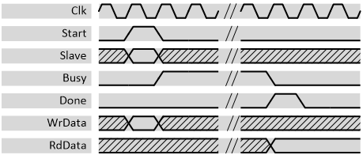

***
# psi_common_spi_master

- VHDL source: [psi_common_spi_master.vhd](../../hdl/psi_common_spi_master.vhd)
- Testbench: [psi_common_spi_master_tb.vhd](../../testbench/psi_common_spi_master_tb/psi_common_spi_master_tb.vhd)

### Description

This entity implements a simple SPI master. All common SPI settings are
settable to ensure the master can be configured for different
applications.

The clock and data phase is configurable according to the SPI standard
terminology described in the picture below:

 

 CPOL and CPHA meaning 

For CPHA = 1, the sampling happens on the second edge (blue) and data is
applied on the first edge (red). For CPHA = 0 it is the opposite way.

### Generics

Generics            | Description
--------------------|---------------------------------------------------
**ClockDivider\_g** | Ratio between *Clk* and the *SpiSck* frequency
**TransWidth\_g**   | SPI Transfer width (bits per transfer)
**CsHighCycles\_g** | Minimal number of *Cs\_n* high cycles between two transfers
**SpiCPOL\_g**      | SPI clock polarity (see figure above)
**SpiCPHA\_g**      | SPI sampling edge configuration (see figure above)
**SlaveCnt\_g**     | Number of slaves to support (number of *Cs\_n* lines)
**LsbFirst\_g**     | **False** = MSB first transmission, **True** = LSB first transmission
**MosiIdleState\_g**| Idle state of the MOSI line

### Interfaces

Signal           | Direction | Width           | Description     
-----------------|-----------|-----------------|-----------------
 Clk             | Input     | 1               | Clock           
 Rst             | Input     | 1               | Reset (highactive)
 Start           | Input     | 1               | A high pulse on this line starts the transfer. Note that starting a transaction is  only possible when *Busy* is low.
 Slave           | Input     | $$\log_{2}{(SlaveCnt\_ g)}$$  | Slave number to access  
 Busy            | Output    | 1               | High during a transaction     
 Done            | Output    | 1               | Pulse that goes high for exactly one clock cycle after a transaction is done and *RdData* is valid        
 WrData          | Input     | *TransWidth\_g* | Data to send to  slave. Sampled  during *Start = '1'*     
 RdData          | Output    | *TransWidth\_g* | Data received from slave. Must be sampled during *Done = '1'* or *Busy = '0'*.          
 SpiSck          | Output    | 1               | SPI clock      
 SpiMosi         | Output    | 1               | SPI master to slave data signal         
 SpiMiso         | Input     | 1               | SPI slave to master data signal          
 SpiCs\_n        | Output    | *SlaveCnt\_g*   | SPI slave select signal (low active)

 

 Parallel interface signal behavior 

***
[Index](../psi_common_index.md) **|** Previous: [Arbiters > arb round_robin](../ch9_arbiters/ch9_2_arb_round_robin.md) **|** Next: [Interfaces > i2c master](../ch10_interfaces/ch10_2_i2c_master.md)
