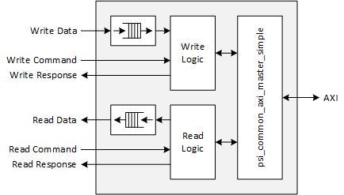
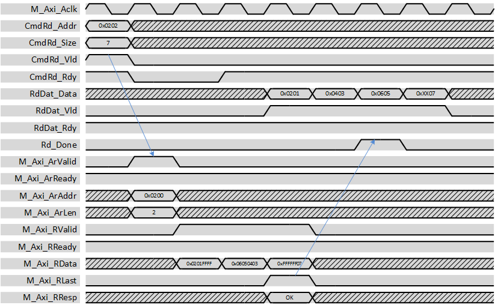
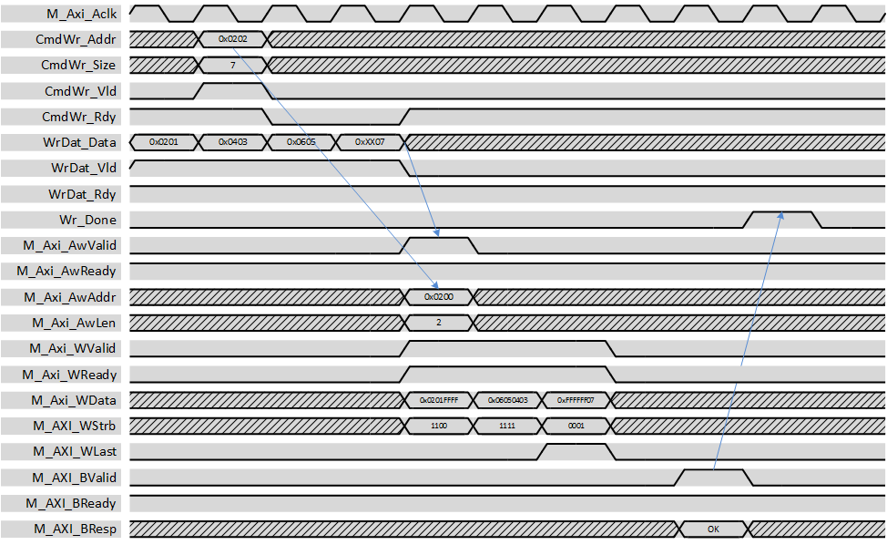

***
# psi_common_axi_master_full

- VHDL source: [psi_common_axi_master_full.vhd](../../hdl/psi_common_axi_master_full.vhd)
- Testbench: [psi_common_axi_master_full_tb.vhd](../../testbench/psi_common_axi_master_full_tb/psi_common_axi_master_full_tb.vhd)

### 1 Description

This entity executes transactions requested through a simple command
interface on an AXI bus according to all specifications. This entity
includes FIFOs to buffer read- and write-data but not for the commands.

This this entity internally uses *psi\_common\_axi\_master\_simple* and
works similarly Many generics are just forwarded to this component and
the meaning of the low-latency function is the same. These topics are
not explained in detail in this section, please refer to 10.3 for
details.

For the case that the AXI data width is larger than the user data width,
it is highly recommended to not use low-latency transfers. Due to the
width conversion, the bandwidth is smaller than the maximum of AXI, so
the bus would be blocked longer than required if low latency transfers
are made.

The user can request transaction of any size and they will get split
automatically in order to not exceed AXI bust size and other
limitations. The response is sent to the user when his whole command is
executed (which may involve multiple AXI transactions).

In contrast to the *psi\_common\_axi\_master\_simple*, this entity has
the following additional features:

-   Execution of unaligned and odd-sized transfers (alignment of the
    data according to AXI requirements)

-   AXI data-width can be larger than user interface data width

-   The transfer size is specified in bytes and not in beats (to allow
    uneven-length transfers)

Most of the logic in this entity is related to unaligned and odd-sized
transfers. So if you only require an AXI data width that is larger than
the user interface data width, you may consider using
*psi\_common\_axi\_master* along with *psi\_common\_wconv\_n2xn* (with
conversion) to achieve better performance with less resource
utilization.

The *psi\_common\_axi\_master\_full* has some clock cycles of overhead
for each command. As a result, large data transfers are efficient but
the performance for very small transfers (only a few AXI bursts) is
limited due to this overhead.

Read and write logic are fully independent. So reads and writes can
happen at the same time.

There is no required timing relationship between command and data
signals. So for writes the user can provide write data before, after or
together with the command.

 Block diagram 

### 2 Transaction Types

For simplicity, only burst transactions are shown. However, of course
also single-word transactions are supported.

Note that latencies and delays may be drawn shorter than they actually
are to keep the waveforms small. However, all relationship between
signals are correct.

For all figures, an AXI-width of 32 bits and a user data width of 16
bits is assumed to keep the figures simple.

For simplicity reasons, only transfers that consist of one AXI
transaction are shown. For the user interface, larger transactions
(consisting of multiple AXI bursts) do behave exactly the same.

For all transactions, user data is right-aligned. The byte at the start
address specified in the command is the LSB of the user input/output
data.

#### 2.1 Read Transaction

The example below shows a read transaction.

  Read transaction 

The read command together with the address of the first used byte and
the size of the data required in bytes is asserted. The
*psi\_common\_axi\_master\_full* then calculates the word-aligned AXI
start address (0x0200) and the number of AXI-beats required (3 \--\>
*M\_Axi\_ArLen*=2) and asserts the AXI AR-command.

The received data is aligned correctly in order to have the first byte
the user requested as LSB of the first *RdDat* word. Unused trailing
bytes may have any value, they shall never be interpreted.

Note that the *Rd\_Done* signal is asserted as soon as all data is read
from AXI, even if the data was not yet consumed on the *RdDat*
interface.

#### 2.2 Write Transaction

The example below shows a read transaction.

Please read the description of all examples (10.4.2).

Note that a high-latency write (AXI commands only sent after data is in
buffer) is shown in this figure.

  Write transaction 

In this example, the user provides some data before the command. This is
perfectly fine and allowed. Then the write command together with the
address of the first byte to write and the size of the data that must be
written in bytes is asserted. The *psi\_common\_axi\_master\_full* then
calculates the word-aligned AXI start address (0x0200) and the number of
AXI-beats required (3 \--\> *M\_Axi\_ArLen*=2) and asserts the AXI
AW-command.

The user data is automatically aligned to the alignment of the AXI bus.
Unused bytes may have any value, which is fine because the corresponding
strobe signal is set to low. The same applies to the user interface:
unused trailing bytes can have any value and do not influence the
transaction.

As soon as the write response from AXI is received, the *Wr\_Done*
signal is asserted.

### 3 Generics

Generics                       | Descritption
-------------------------------|-----------------------------------------------------------
**AxiAddrWidth\_g**            |Width of the AXI address bus
**AxiDataWidth\_g**            |Width of the AXI data bus
**AxiMaxBeats\_g\***           |Maximum number of beats in one AXI transaction. Values given by the AXI specification are 16 for AXI-3 and 256 for AXI-4. However, the user may choose any other number for scheduling reasons.
**AxiMaxOpenTransactions\_g**  |Maximum number of AXI commands (AW/AR-channel) to send before the first command is completed (outstanding transactions).
**UserTransactionSizeBits \_g**|Number of bits used to specify the number of bytes to transfer on the user command interface. This is the only limiting factor for the transfer size requested.
**DataFifoDepth\_g**           |Number of entries in the read/write data FIFOs (user side)
**AxiFifoDepth\_g**            |Number of entries in the FIFOs inside the AXI interface
**DataWidth\_g**               |Width of the user data interface
**ImplRead\_g**                |Implement read functionality (can be disabled to save resources)
**ImplWrite\_g**               |Implement write functionality (can be disabled to save resources)
**RamBehavior\_g**             |Block-RAM style (must match FPGA architecture),**"RBW"** Read before write,**"WBR"** Write before read

#### 3.1 FIFO Parametrization

This section explains the most important points about parametrizing
buffer sizes on the user side (*DataFifoDepth\_g*) and on the AXI side
(*AxiFifoDepth\_g)*.

The *DataFifoDepth\_g* sets the depth of the FIFOs on the user interface
as shown in the block diagram. For writes, this determines how much data
can be accepted before a command is applied. The user side buffers have
the width of the user-interface, so for writes, data in these buffers
still must be converted to the AXI bus width (if *AxiDataWith\_g \>
DataWidth\_g*) and cannot be transmitted over AXI with ideal
performance.

The *AxiFifoDepth\_g* sets the depth of the FIFOs inside the AXI
interface that have the same width as the AXI bus. These FIFOs can only
be filled after a command is sent. On the other hand, the data buffered
in these FIFOs can be sent over AXI with ideal performance, so this
buffer shall be used to compensate effects due to the AXI bus being
busy.

For reads, it does not matter much, in which FIFO the data is buffered
since the bandwidth on the user-interface is always smaller or equal to
the bandwidth of the AXI interface. As a result, the width-conversion
does not lead to a bottleneck (like it is this case for writes).

### 4 Interfaces

  Signal                      |Direction  |Width                        |Description
  ----------------------------|-----------|-----------------------------|--------------------------------------------------------------------------------------------------------------
  ***Control Signals***       |           |                             |
  M\_Axi\_Aclk                |Input      |1                            |Clock
  M\_Axi\_Aresetn             |Input      |1                            |Reset (low active)
  ***Write Command***         |           |                             |
  CmdWr\_Addr                 |Input      |*AxiAddrWidth\_g*            |Address to start writing at (must be aligned)
  CmdWr\_Size                 |Input      |*UserTransactionSizeBits\_g* |Number of bytes in the transfer
  CmdWr\_LowLat               |Input      |1                            |**'1'** \--\> Low latency mode, **'0'** \--\> High latency mode
  CmdWr\_Vld                  |Input      |1                            |AXI-S handshaking signal
  CmdWr\_Rdy                  |Output     |*1*                          |AXI-S handshaking signal
  ***Read Command***          |           |                             
  CmdRd\_Addr                 |Input      |*AxiAddrWidth\_g*            |Address to start reading at (must be aligned)
  CmdRd\_Size                 |Input      |*UserTransactionSizeBits\_g* |Number of bytes in the transfer
  CmdRd\_LowLat               |Input      |1                            |**'1'** \--\> Low latency mode, **'0'** \--\> High latency mode
  CmdRd\_Vld                  |Input      |1                            |AXI-S handshaking signal
  CmdRd\_Rdy                  |Output     |1                            |AXI-S handshaking signal
  ***Write Data***            |           |                             |
  WrDat\_Data                 |Input      |*DataWidth\_g*               |Write data (right-aligned)
  WrDat\_Vld                  |Input      |1                            |AXI-S handshaking signal
  WrDat\_Rdy                  |Output     |1                            |AXI-S handshaking signal
  ***Read Data***             |           |                             |
  RdDat\_Data                 |Output     |*DataWidth\_g*               |Read data (right-aligned)
  RdDat\_Vld                  |Output     |1                            |AXI-S handshaking signal
  RdDat\_Rdy                  |Input      |1                            |AXI-S handshaking signal
  ***Response***              |           |                             |
  Wr\_Done                    |Output     |1                            |Write command was completed successfully
  Wr\_Error                   |Output     |1                            |Write command was completed but at least one transaction failed (AXI response from slave indicated an error)
  Rd\_Done                    |Output     |1                            |Read command was completed successfully
  Rd\_Error                   |Output     |1                            |Read command was completed but at least one transaction failed (AXI response from slave indicated an error)
  ***AXI Master Interface***  |           |                             |
  M\_Axi\_\*                  |\*         |\*                           |AXI signals, see AXI specification

[Index](../psi_common_index.md) **|** Previous: [Interfaces > axi master simple](../ch10_interfaces/ch10_3_axi_master_simple.md) **|** Next: [Interfaces > axi slave ipif](../ch10_interfaces/ch10_5_axi_slave_ipif.md)
