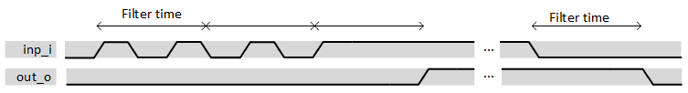

***
# psi_common_debouncer

- VHDL source: [psi_common_debouncer.vhd](../../hdl/psi_common_debouncer.vhd)
- Testbench:  [psi_common_debouncer_tb.vhd](../../testbench/psi_common_debouncer_tb/psi_common_debouncer_tb.vhd)

### Description
This component is a simple de-bouncer element where the filter time
period is settable via generic as well as the polarity of both input and
output. If the input is toggling during less time than the one set as
generic in sec. the output won't be forwarded to the output. The counter
start is triggered via the input change of state, once the counter reach
the time predefined the output value is then forwarded depending on the
desired polarity.

 

 datagram if len_g = 1 

### Generics

Generics        | Description
----------------|-------------------------------------------------
**freq\_clk\_g**|Frequency clock
**dbnc\_per\_g**|Filtering time in sec
**sync\_g** 		|Add double stage synchronizer\
**out\_pol\_g** |define the output polarity, active high or low
**in\_pol\_g**  |define the input polarity, active high or low
**rst\_pol\_g** |reset polarity ('1' or '0')
**len\_g**      |vector input length

### Interfaces

Signal  |Direction  |Width   |Description
--------|-----------|--------|---------------------------------
clk\_i  |Input      |1       |Clock
rst\_i  |Input      |1       |Reset (polarity set by generic)
inp\_i  |Input      |len\_g  |data input
out\_o  |Output     |len\_g  |data output

***
[Index](../psi_common_index.md) **|** Previous: [Misc > dont opt](../ch11_misc/ch11_7_dont_opt.md)
