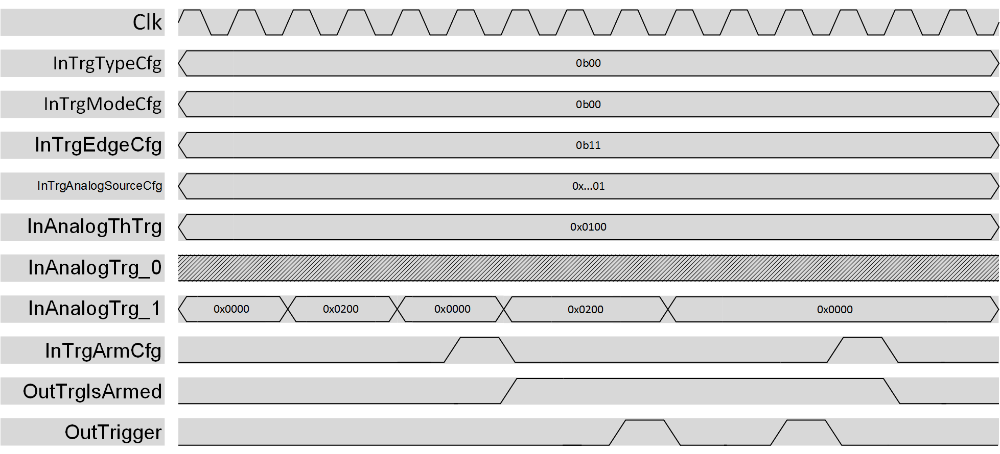

***

# psi_common_trigger_analog

- VHDL source: [psi_common_trigger_analog.vhd](../../hdl/psi_common_trigger_analog.vhd)
- Testbench: [psi_common_trigger_analog_tb.vhd](../../testbench/psi_common_trigger_analog_tb/psi_common_trigger_analog_tb.vhd)

### Description

This component can be used to generate a single clock pulse when
 its input value overpass a certain threshold.
The trigger generation can be continuous, hence a pulse is generated every 
time the condition is satisfied or single, and the trigger generator must 
be re-armed after every generated pulse.
The pulse is generated if the value represented in a (signed or unsigned) 
std_logic_vector crosses a threshold value decided by the user, the sensitive 
edge can be rising, falling or both.

  

 analog trigger datagram

NOTE: once the selected condition is satisfied, the trigger pulse is generated 
with a two clock cycle delay. This is due to the internal logic structure and 
it can be compensated externally by the user.

### Generics

Generics                     | Description
-----------------------------|-------------------------------------------------------------
**analog\_input\_number\_g** |Number of analog trigger input
**analog\_input\_width\_g**  |Analog trigger input signals width
**analog\_trg\_signed\_g**   |Analog trigger input signals are signed (true or false)
**rst\_pol\_g**              |Reset polarity ('1' or '0')

### Interfaces
Signal               |Direction  |Width                                              |Description
---------------------|-----------|---------------------------------------------------|--------------------------------------------------------------------------------------------------
InClk                |Input      |1                                                  |Clock
InRst                |Input      |1                                                  |Reset (polarity set by generic)
InTrgModeCfg         |Input      |1                                                  |Trigger mode: 0:Continuous, 1:Single 
InTrgArmCfg          |Input      |1                                                  |Arm or Dis-arm the trigger mechanism. The logic is sensitive to the rising edge of this signal.
InTrgEdgeCfg         |Input      |2                                                  |Trigger edge direction: bit 1: if 1 rising edge enabled, bit 0: if 1 falling edge enabled
InTrgAnalogSourceCfg |Input      |log2ceil(analog\_input\_number\_g)                 |Select which InAnalogTrg use as input
InAnalogThTrg        |Input      |analog\_input\_width\_g                            |Threshold value 
InAnalogTrg          |Input      |analog\_input\_number\_g * analog\_input\_width\_g |Analog input values
InExtDisarm          |Input      |1                                                  |Disarm the trigger without generating the OutTrigger pulse. Useful if the logic is used with other trigger logic 
OutTrgIsArmed        |Output     |1                                                  |If the trigger mechanism is armed, this output is 1
OutTrigger           |Output     |1                                                  |When the selected input passes the threshold value, a single clock pulse is generated

***
[Index](../psi_common_index.md) **|** Previous: [Misc > delay cfg](../ch11_misc/ch11_8_debouncer.md) **|** Next:  [Misc > dont opt](../ch11_misc/ch11_10_trigger_digital.md)
