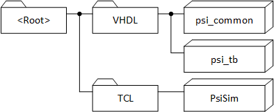
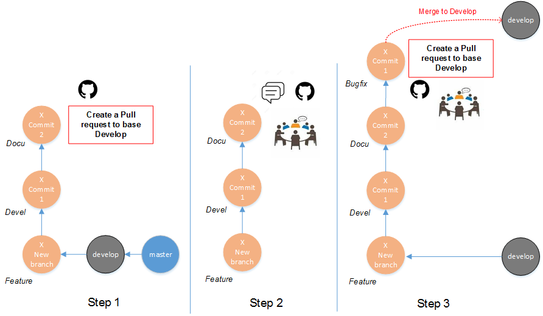
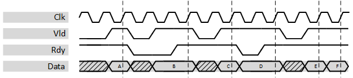

***

# Introduction

## 1.1 Working Copy Structure
If you just want to use some components out of the *psi\_common*
library, no special structure is required and the repository can be used
standalone.

If you want to also run simulations and/or modify the library,
additional repositories are required (available from the same source as
*psi\_common*) and they must be checked out into the folder structure
shown in the figure below since the repositories reference each-other
relatively.

It is not necessary but recommended to use the name *psi\_lib* as name
for the *\<Root\>* folder.

## 1.2 VHDL Libraries

PSI VHDL libraries (including psi_common) require all files to be compiled into the same VHDL library.
There are two common ways of using VHDL libraries when using PSI VHDL libraries:
-	All files of the project (including project specific sources and PSI VHDL library sources) are compiled into the same library that may have any name.
In this case PSI library entities and packages are referenced by **work.psi_[library]_[xxx]** (e.g. work.psi_common_pl_stage or work.psi_common_array_pkg.all).
-	All code from PSI VHDL libraries is compiled into a separate VHDL library. It is recommended to use the name psi_lib.
In this case PSI library entities and packages are referenced by **psi_lib.psi_[lib]_[xxx]** (e.g. psi_lib.psi_common_pl_stage or psi_lib.psi_common_array_pkg.all).

## 1.3 Running simulations

### 1.3.1 Regression Test
#### 1.3.1.1 Modelsim
To run the regression test, follow the steps below:
-	Open Modelsim
-	The TCL console, navigate to <Root>/VHDL/psi_common/sim
-	Execute the command “source ./run.tcl”
All test benches are executed automatically and at the end of the regression test, the result is reported

#### 1.3.1.2 GHDL
In order to run the regression tests using GHDL, GHDL must be installed and added to the path variable. Additionally a TCL interpreter must be installed.
To run the regression tests using GHDL, follow the steps below:
-	Open the TCL interpreter (usually by running tclsh)
-	The TCL console, navigate to <Root>/VHDL/psi_common/sim
-	Execute the command **“source ./runGhdl.tcl”**
All test benches are executed automatically and at the end of the regression test, the result is reported

### 1.3.2 Working Interactively

During work on library components, it is important to be able to control simulations interactively. To do so, it is suggested to follow the following flow:
*	Open Modelsim
*	The TCL console, navigate to <Root>/VHDL/psi_common/sim
*	Execute the command **“source ./interactive.tcl”**
	* This will compile all files and initialize the PSI TCL framework
	* From this point on, all the commands from the PSI TCL framework are available, see documentation of PsiSim
*	Most useful commands to recompile and simulate entities selectively are
	* **_compile_files –contains [string]_**
	* **_run_tb –contains [string]_**
	* **_launch_tb –contains [string]_**

The steps for GHDL are the same, just in the TCL interpreter shall instead of the Modelsim TCL console.

## 1.4 Contribute to PSI VHDL Libraries
To contribute to the PSI VHDL libraries, a few rules must be followed:
*	**Good Code Quality**
	* There are not hard guidelines. However, your code shall be readable, understandable, correct and save. In other words: Only good code quality will be accepted.

*	**Configurability**
	* If there are parameters that other users may have to modify at compile-time, provide generics. Only code that is written in a generic way and can easily be reused will be accepted.

*	**Self-checking Test-benches**
	* It is mandatory to provide a self-checking test-bench with your code.
	The test-bench shall cover all features of your code
	* The test-bench shall automatically stop after it is completed (all processes halted, clock-generation stopped). See existing test-benches provided with the library for examples.
	* The test-bench shall only do reports of severity error, failure or even fatal if there is a real problem.
	* If an error occurs, the message reported shall start with “###ERROR###:”. This is required since the regression test script searches for this string in reports.

*	**Documentation**
	* Extend this document with proper documentation of your code.

*	**New test-benches** must be added to the regression test-script
	* Change /sim/config.tcl accordingly
	* Test if the regression test really runs the new test-bench and exits without errors before doing any merge requests.

* **GIT commit annotations**, please add a short description at first of your commit annotation, this ease the maintainer to merge, write the changelog.md file while doing new release and others to understand what has been committed, here below there are 6 inputs that are commonly use.
	* **_FEATURE_**: Adding a new feature to library like a component or a package element (i.e. function, procedure, type and constant)
	* **_GIT_**: when committing some GIT related issue, merging, etc…
	*	**_BUGFIX_**: when a fix has been made
	*	**_DOCU_**: documentation related comment
	*	**_DEVEL_**: when a commit is done but work is in development
	* **_TB_**: test bench related commit

7.	**Working with GIT**
  * If a user wants to participate to the library he is free to do so, however some rules should be considered. All PSI libraries have at least two branches develop & master. The master branch is used for stable release version all changes are merge to master when required. The develop branch is the branch when a GIT user shall diverge from to add a new component.
  * A good practice is to call the branch the name of the new block, the user is free to push into this branch and once the work is over a pull request can be done to the base branch develop (Step 1). Members of the library may then have exchange and add comment during a code review (Step 2). The initial user takes into consideration the comment and once bug are fixed for instance a new pull request can be done. If members agree on the new feature then it is merged to develop (Step 3) and the branch will be safely deleted by the repository maintainer.

## 1.5 Handshaking Signals
### 1.5.1	General Information
The PSI library uses the AXI4-Stream handshaking protocol (herein after called AXI-S). Not all entities may implement all optional features of the AXI-S standard (e.g. backpressure may be omitted) but the features available are implemented according to AXI-S standard and follow these rules.
The full AXI-S specification can be downloaded from the ARM homepage:
https://developer.arm.com/docs/ihi0051/a
The most important points of the specification are outlined below.
### 1.5.2	Excerpt of the AXI-S Standard
A data transfer takes place during a clock cycle where TVALID and TREADY (if available) are high. The order in which they are asserted does not play any role.
-	A master is not permitted to wait until TREADY is asserted before asserting TVALID.
-	Once TVALID is asserted it must remain asserted until the handshake occurs.
-	A slave is permitted to wait for TVALID to be asserted before asserting the corresponding TREADY.
-	If a slave asserts TREADY, it is permitted to de-assert TREADY before TVALID is asserted.
An example an AXI handshaking waveform is given below. All the points where data is actually transferred are marked with dashed lines.

### 1.5.3	Naming
The naming conventions of the AXI-S standard are not followed strictly. The most common synonyms that can be found within the PSI VHDL libraries are described below:
- TDATA	InData, OutData, Data, Sig, Signal, <application specific names>
- TVALID	Vld, InVld, OutVld, Valid, str, str_i
- TREADY	Rdy, InRdy, OutRdy

Note that instead of one TDATA signal (as specified by AXI-S) the PSI VHDL Library sometimes has multiple data signals that are all related to the same set of handshaking signals. This helps with readability since different data can is represented by different signals instead of just one large vector.

## 1.6 TDM

**Rules**

-	If multiple signals are transferred TDM (time-division-multiplexed) over the same interface and all signals have the same sample rate, no additional channel indicator is implemented and looping through the channels is implicit (e.g. for a three channel link, samples are transferred in the channel order 0-1-2-0-1-2-…).

- If multiple signals are transferred TDM over the same interface and the channels do not have the same sample rate, an additional channel indicator containing the channel number is present.

**Reasoning**

Not having an additional channel indicator for the most common TDM use-case of multiple signals at the same sample rate prevents any combinatorial blocks from having to know about being used for a TDM signal and maintaining the channel indicator. This implicitly allows using all combinatorial library elements (e.g. binary divider, function approximations, etc.) also for TDM signals

***

[Index](../psi_common_index.md) **|** Next: [Packages](../ch2_packages/ch2_packages.md)
