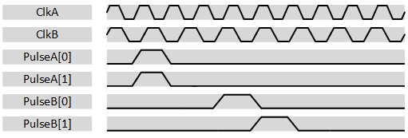
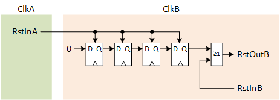

***

# psi\_common\_pulse\_cc

- VHDL source: [psi_common_pulse_cc.vhd](../../hdl/psi_common_pulse_cc_.vhd)
- Testbench: [psi_common_pulse_cc_tb.vhd](../../testbench/psi_common_pulse_cc_tb/psi_common_pulse_cc_tb.vhd)

### Description

This component implements a clock crossing for transferring single pulses from one clock domain to another (completely asynchronous clocks).

The entity shall only be used for single-cycle pulses and the pulse frequency must be lower than the frequency of the slower clock for it to work correctly.

The entity does only guarantee that all pulses arrive at the destination clock domain. It does not guarantee that pulses that occur in the same clock cycle on the source clock domain, occur on the target clock domain in the same clock cycle. As a result it should only be used to do
clock-crossings for individual pulses.

This entity does also do the clock-crossing for the reset by using "asynchronously assert, synchronously de-assert" synchronizer chains and applying all attributes to synthesize them correctly.

### Generics
Generics         | Description
-----------------|-------------
**NumPulses\_g** | Width of the FIFO

### Interfaces

Signal                | Direction  | Width         | Description
----------------------|------------|---------------|-----------------------------------------------   
ClkA                  | Input      | 1             | Clock A
RstInA                | Input      | 1             | Clock domain A reset input (active high)
RstOutA               | Output     | 1             | Clock domain A reset output (active high), active if *RstInA* or *RstInB* is asserted, de-asserted synchronously to *ClkA*
PulseA                | Input      | NumPulses\_g  | Input of the pulse signals          
ClkB                  | Input      | 1             | Clock B
RstInB                | Input      | 1             | Clock domain A reset input (active high)
RstOutB               | Output     | 1             | Clock domain B reset output (active high), active if *RstInA* or *RstInB* is asserted, de-asserted synchronously to *ClkA*
PulseB                | Output     | NumPulses\_g  | Output of the pulse signals

### Architecture

The figure below shows how the pulses are transferred from one clock domain to the other.

  

Since each pulse is handled separately, the pulse alignment may change because of the clock crossing. This is shown in the figure below.

  

The figure below shows how the reset signal is transferred from one clock domain to the other. This concept is used to transfer resets in both directions between the clock domains but for simplicity only one direction is shown in the figure.

  

### Constraints

This entity does not require any constraints.
***
[Index](../psi_common_index.md) **|** Previous: [FIFO > sync fifo](../ch4_fifos/ch4_2_sync_fifo.md) **|** Next: [cdc > simple cc](../ch5_cc/ch5_2_simple_cc.md)
