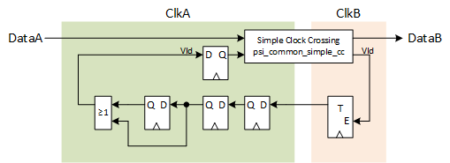

***
# psi_common_status_cc

- VHDL source: [psi_common_status_cc.vhd](../../hdl/psi_common_status_cc_.vhd)
- Testbench: [psi_common_status_cc_tb.vhd](../../testbench/psi_common_status_cc_tb/psi_common_status_cc_tb.vhd)

### Description

This component implements a clock crossing for slowly changing status information that does not have exact sample rates. It can for example be used to transfer a buffer fill level from one clock domain to another with minimal effort.

The entity ensures that data from the source clock domain is correctly
transferred to the destination clock domain. The value at the
destination clock domain is always correct in terms of "either the last
transferred value or the next one". The exact timing of the sampling
points at which the data is transferred is generated by the entity
itself, so it is unknown to the user. As a result, the entity does not
guarantee to show transfer state of the data signal in the source clock
domain to the destination clock domain in cases of fast changing
signals.

For the entity to work correctly, the data-rate must be significantly
lower (10 x lower) than the slower clock frequency. Of course the signal
can change more quickly but the clock crossing will skip some values in
this case.

This entity does also do the clock-crossing for the reset by using
"asynchronously assert, synchronously de-assert" synchronizer chains and
applying all attributes to synthesize them correctly.

### Generics

Generics       | Description
---------------|-------------
**Width\_g** 	 |	Width of the data signal to implement the clock crossing for

### Interfaces

Signal                |Direction  |Width     | Description
----------------------|-----------|----------| -----------------------------------------------
ClkA                  |Input      |1         | Clock A
RstInA                |Input      |1         | Clock domain A reset input (active high)
RstOutA               |Output     |1         | Clock domain A reset output (active high), active if *RstInA* or *RstInB* is asserted, de-asserted synchronously to *ClkA*
DataA                 |Input      |Width\_g  | Data signal input
ClkB                  |Input      |1         | Clock B
RstInB                |Input      |1         | Clock domain A reset input (active high)
RstOutB               |Output     |1         | Clock domain B reset output (active high), active if *RstInA* or *RstInB* is asserted, de-asserted synchronously to *ClkA*
DataB                 |Output     |Width\_g  | Data signal output

### Architecture

The concept of this clock crossing is to use *psi\_common\_simple\_cc*
for the data signal, so the main functionality of this entity is to
automatically generate valid pulses.

The first *Vld* pulse is generated in clock domain *ClkA* after the
reset. At this point, the data is sampled and transferred to *ClkB*.
When the *Vld* pulse arrives at *ClkB*, it is transferred back to *ClkA*
and the next data word is transferred. This setup ensures that *Vld*
pulses are generated at a rate that allows the
*psi\_common\_simple\_cc* to transfer the data correctly without any
knowledge about the frequencies of both clock domains.

The concept is shown in the figure below.

<p align="center"> </p>

### Constraints

For the entity to work correctly, signals from the source clock domain
to the destination clock domain must be constrained to have not more
delay that one clock cycle of the destination clock.

Example with a 100 MHz source clock (10.0 ns period) and a 33.33 MHz
destination clock (30 ns period) for Vivado:

```tcl
set_max_delay --datapath_only --from <ClkA> -to <ClkB> 30.0
```

***
[Index](../psi_common_index.md) **|** Previous: [cdc > pulse cc](../ch5_cc/ch5_2_simple_cc.md) **|** Next: [cdc > status cc](../ch5_cc/ch5_4_sync_cc_n2xn.md)
