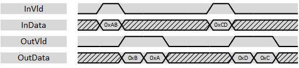

***
# psi_common_wconv_xn2n

- VHDL source: [psi_common_wconv_xn2n.vhd](../../hdl/psi_common_wconv_xn2n.vhd)
- Testbench: [psi_common_wconv_xn2n_tb.vhd](../../testbench/psi_common_wconv_xn2n_tb/psi_common_wconv_xn2n_tb.vhd)

### Description
This component implements a data width conversion from a multiple N-bits to a N-bits. The sample rate is increased accordingly. The width conversion implements AXI-S handshaking signals to handle back-pressure.

The width conversion does support back-to-back conversions (*OutVld/OutRdy* can stay high all the time).

The entity does little-endian data alignment as shown in the figure below.

  

 Data alignment 

The with conversion does also handle the last-flag according to AXI specification and it can do alignment. To do so, an input word-enable signal *InWe* exists. Words that are not enabled are not sent to the output. If the input is marked with the *InLast* flag, the last enabled word is marked with *OutLast* at the output.

Note that with the assertion of *InLast* at least one byte of the data must be valid (*InWe* high). Otherwise it would be unclear when *OutLast* shall be assigned.

  

 Last-Handling and alignment 

This entity does only do a width conversion but not clock crossing. If a double-clock-half-width conversion is used, *psi\_common\_sync\_cc\_n2xn* component can be used in front of the
width conversion.

### Generics
Generics        | Description
----------------|------------------
**InWidth\_g**  |Input data width
**OutWidth\_g** |Output data width

The ratio InWidth\_g/OutWidth\_g must be an integer number and *InWidth \_g* must be bigger or equal to *OutWidth\_g*.

### Interfaces
Signal          | Direction | Width           | Description     
----------------|-----------|-----------------|-----------------               
Clk             | Input     | 1               | Clock           
Rst             | Input     | 1               | Reset (high active)                 
InVld           | Input     | 1               | AXI-S handshaking signal          
InRdy           | Output    | 1               | AXI-S handshaking     signal          
InData          | Input     | InWidth\_g      | Data signal input           
InLast          | Input     | 1               | AXI-S handshaking signal
InWe            | Input     | InWidth\_g/OutWidth\_g  | Input word-enable. Works like byte-enable but with one bit per input-word. At least one word must be enabled together with the assertion of InLast   
OutVld          | Output    | 1               | AXI-S handshaking signal          
OutRdy          | Input     | 1               | AXI-S handshaking signal          
OutData         | Output    | OutWidth\_g     | Data signal output          
OutLast         | Output    | 1               | AXI-S handshaking signal          

***
[Index](../psi_common_index.md) **|** Previous: [conversion > wconv n2xn](../ch7_conversions/ch7_1_wconv_n2xn.md) **|** Next: [TDM handling > par tdm](../ch8_tdm_handling/ch8_1_par_tdm.md)
