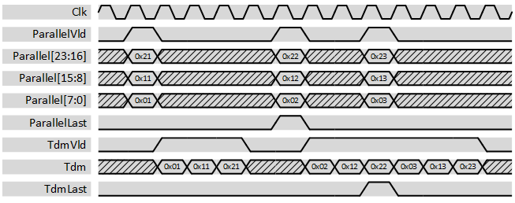

***
# psi_common_par_tdm

- VHDL source: [psi_common_par_tdm.vhd](../../hdl/psi_common_par_tdm.vhd)
- Testbench: [psi_common_par_tdm_tb.vhd](../../testbench/psi_common_par_tdm_tb/psi_common_par_tdm_tb.vhd)

### Description

This component changes the representation of multiple channels from parallel to time-division-multiplexed. It does not implement any
flow-control, so the user is responsible to not apply input data faster than it can be represented at the output (time-division-multiplexed).

The figure below shows some waveforms of the conversion. The lowest bits of the input vector are interpreted as channel 0 and played out first, the highest bits of the input vector are played out last.

  

### Generics

Generics            | Description
--------------------|-------------------------------
**ChannelCount\_g** | Number of channels
**ChannelWidth\_g** | Number of bits per channel

### Interfaces

Signal                 |Direction  |Width                             |Description
-----------------------|-----------|----------------------------------|----------------------------------------------------------------------------------------
Clk                    |Input      |1                                 |Clock
Rst                    |Input      |1                                 |Reset (high active)
ParallelVld            |Input      |1                                 |AXI-S handshaking signal
ParallelRdy						 |Output		 |1																	|AXI-S handshaking signal
Parallel               |Input      |ChannelCount\_g\*ChannelWidth\_g  |Data of all channels in parallel. Channel 0 is in the lowest bit and played out first.
TdmVld                 |Output     |1                                 |AXI-S handshaking signal
Tdm                    |Output     |ChannelWidth                      |Data signal output
TdmRdy								 |Input			 |1																	|AXI-S handshaking signal

***
[Index](../psi_common_index.md) **|** Previous: [conversion > wconv n2xn](../ch7_conversions/ch7_2_wconv_xn2n.md) **|** Next: [TDM handling > tdm par](../ch8_tdm_handling/ch8_2_tdm_par.md)
