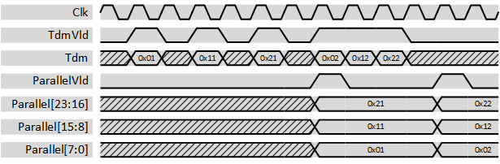

***
# psi_common_tdm_par

- VHDL source: [psi_common_tdm_par.vhd](../../hdl/psi_common_tdm_par.vhd)
- Testbench: [psi_common_tdm_par_tb.vhd](../../testbench/psi_common_tdm_par_tb/psi_common_tdm_par_tb.vhd)

### Description

This component changes the representation of multiple channels from time-division-multiplexed to parallel. It does not implement any flow-control.

The figure below shows some waveforms of the conversion. The first input sample is interpreted as channel 0 and played out in the lowest bits of the output, the last input sample is played out in the highest bits.

  

### Generics
Generics            | Description
--------------------|---------
**ChannelCount\_g** | Number of channels
**ChannelWidth\_g** | Number of bits per channel

### Interfaces

Signal                 | Direction | Width                               |Description
-----------------------|-----------|-------------------------------------|--------------------------------------------------------------------
  Clk                  |    Input  |    1                                | Clock
  Rst                  |    Input  |    1                                | Reset (high active)
  TdmVld               |    Input  |    1                                | AXI-S handshaking signal
	TdmRdy							 |    Output |	  1															   |	AXI-S handshaking signal
  Tdm                  |    Input  |    ChannelWidth_g                   | TDM input signal, first sample is channel 0.
  ParallelVld          |    Output |    1                                | AXI-S handshaking signal
	ParallelRdy					 |		Input	 |    1																 | AXI-S handshaking signal
  Parallel             |    Output |    ChannelCount\_g\*ChannelWidth\_g | Data of all channels in parallel. Channel 0 is in the lowest bits.

***
[Index](../psi_common_index.md) **|** Previous: [TDM hanlding >par tdm](../ch8_tdm_handling/ch8_1_par_tdm.md) **|** Next: [TDM handling > tdm par cfg](../ch8_tdm_handling/ch8_3_tdm_par_cfg.md)
