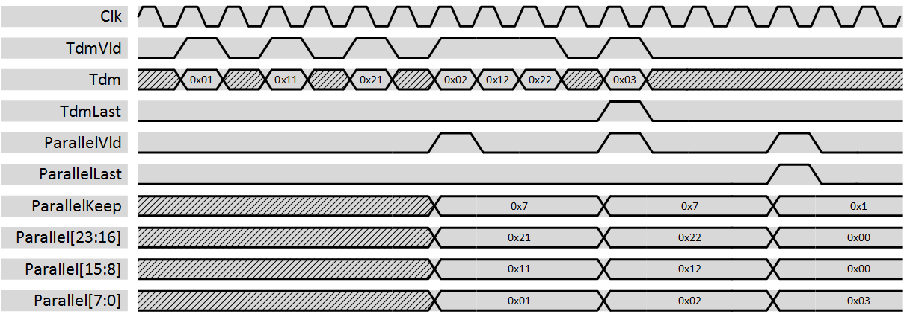

***
# psi_common_tdm_par_fill

- VHDL source: [psi_common_tdm_par.vhd](../../hdl/psi_common_tdm_par_fill.vhd)
- Testbench: [psi_common_tdm_par_tb.vhd](../../testbench/psi_common_tdm_par_fill_tb/psi_common_tdm_par_fill_tb.vhd)

### Description

This component changes the representation of multiple channels from time-division-multiplexed to parallel. It also interpretes the 'last' flag at the input and generates a correspodning 'last' flag as well as a 'keep' vector at the output while filling up missing bits with zeros to complete the output word. Note that the keep vector might only be useful if the intput width is eight bits in a standard AXI environment. The component does not implement any flow-control.

The figure below shows some waveforms of the conversion. The first input sample is interpreted as channel 0 and played out in the lowest bits of the output, the last input sample is played out in the highest bits. The bits of the keep vector are assigned accordingly, i.e. the LSB corresponds to the first input sample.

  

### Generics
Generics            | Description
--------------------|---------
**ChannelCount\_g** | Number of channels
**ChannelWidth\_g** | Number of bits per channel

### Interfaces

Signal                 | Direction | Width                               |Description
-----------------------|-----------|-------------------------------------|--------------------------------------------------------------------
  Clk                  |    Input  |    1                                | Clock
  Rst                  |    Input  |    1                                | Reset (high active)
  TdmVld               |    Input  |    1                                | AXI-S handshaking signal
  TdmRdy               |    Output |    1                                | AXI-S handshaking signal
  TdmLast              |    Input  |    1                                | AXI-S packet bondary signal
  Tdm                  |    Input  |    ChannelWidth_g                   | TDM input signal, first sample is channel 0.
  ParallelVld          |    Output |    1                                | AXI-S handshaking signal
  ParallelRdy          |    Input  |    1                                | AXI-S handshaking signal
  ParallelLast         |    Output |    1                                | AXI-S packet bondary signal
  ParallelKeep         |    Output |    ChannelCount\_g                  | AXI-S byte qualifier signal
  Parallel             |    Output |    ChannelCount\_g\*ChannelWidth\_g | Data of all channels in parallel. Channel 0 is in the lowest bits.

***
[Index](../psi_common_index.md) **|** Previous: [TDM hanlding >par tdm cfg](../ch8_tdm_handling/ch8_5_par_tdm_cfg.md) **|** Next: [Arbiters > arb priority](../ch9_arbiters/ch9_1_arb_priority.md)
