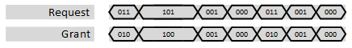
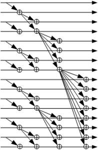

***
# psi_common_arb_priority

- VHDL source: [psi_common_arb_priority.vhd](../../hdl/psi_common_arb_priority.vhd)
- Testbench: [psi_common_arb_priority_tb.vhd](../../testbench/psi_common_arb_priority_tb/psi_common_arb_priority_tb.vhd)

### Description

This entity implements a priority arbiter. The left-most bit (highest
bit) of the request vector that was asserted is granted (i.e. asserted
in the grant vector). The arbiter is implemented using the very logic-
and timing-efficient parallel prefix computation approach.

The arbiter can be implemented with or without an output register. The
waveform below shows its implementation without output register
(*OutputRegister\_g = false*), since the delay would make the waveform
less easy to read.

### Generics

Generics						  | Description
----------------------|-----------------------------------------------------
**Size\_g** 				  |Size of the arbiter (number of input/output bits)
**OutputRegister\_g** | True = Registered output False = Combinatorial output

### Interfaces

Signal              | Direction | Width     | Description
--------------------|-----------|-----------|-----------------------------------------------
Clk                 | Input     | 1         | Clock
Rst                 | Input     | 1         | Reset (high active)
Request             | Input     | *Size\_g* | Request input signals, The highest (left-most) bit has highest priority
Grant               | Output    | *Size\_g* | Grant output signal

### Architecture

Parallel prefix computation is used to calculate a vector that contains
a '1' on the highest-priority bit that was asserted and on all bits with
lower priority. The vector then looks for example like this "0001111".
The bit to assert in the *Grant* output can then be determined by
finding the 0-1 edge inside that vector.

The figure below shows the parallel prefix computation graphically.

***
[Index](../psi_common_index.md) **|**  Previous: [TDM hanlding >par tdm cfg](../ch8_tdm_handling/ch8_5_par_tdm_cfg.md) **| **Next: [Arbiters > arb round_robin](../ch9_arbiters/ch9_2_arb_round_robin.md)
