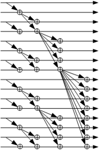

***

[**component list**](../README.md)

# psi_common_arb_priority
 - VHDL source: [psi_common_arb_priority](../../hdl/psi_common_arb_priority.vhd)
 - Testbench source: [psi_common_arb_priority_tb.vhd](../../testbench/psi_common_arb_priority_tb/psi_common_arb_priority_tb.vhd)

### Description

This entity implements a priority arbiter. The left-most bit (highest bit) of the request vector that was asserted is granted (i.e. asserted in the grant vector). The arbiter is implemented using the very logic-
and timing-efficient parallel prefix computation approach.

The arbiter can be implemented with or without an output register. The waveform below shows its implementation without output register (*OutputRegister\_g = false*), since the delay would make the waveform less easy to read.

### Generics
| Name      | type      | Description         |
|:----------|:----------|:--------------------|
| size_g    | natural   | Size of the arbiter (number of input/output bits)
| out_reg_g | boolean   | True = Registered output False = Combinatorial output
| rst_pol_g | std_logic | reset polarity

### Interfaces
| Name    | In/Out   | Length   | Description                |
|:--------|:---------|:---------|:---------------------------|
| clk_i   | i        | 1        | Clock
| rst_i   | i        | 1        | Reset (high active)
| req_i   | i        | size_g   | Request input signals, The highest (left-most) bit has highest priority
| grant_o | o        | size_g   | Grant output signal                       

Parallel prefix computation is used to calculate a vector that contains a '1' on the highest-priority bit that was asserted and on all bits with lower priority. The vector then looks for example like this "0001111". The bit to assert in the *Grant* output can then be determined by finding the 0-1 edge inside that vector.

The figure below shows the parallel prefix computation graphically.

[**component list**](../README.md)
