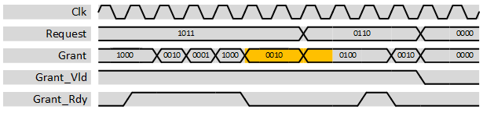

***

[**component list**](../README.md)

# psi_common_arb_round_robin
 - VHDL source: [psi_common_arb_round_robin](../../hdl/psi_common_arb_round_robin.vhd)
 - Testbench source: [psi_common_arb_round_robin_tb.vhd](../../testbench/psi_common_arb_round_robin_tb/psi_common_arb_round_robin_tb.vhd)

### Description

This entity implements a round-robin arbiter. If multiple bits are asserted in the request vector, the left-most bit is forwarded to the grant vector first. Next, the second left-most bit that is set is forwarded etc. Whenever at least one bit in the *Grant* vector is asserted, the *Grant\_Vld* handshaking signal is asserted to signal that a request was granted. The consumer of the *Grant* vector signalizes that the granted access was executed by pulling *Grant\_Rdy* high.

Note that the round-robin arbiter is implemented without an output register. Therefore combinatorial paths between input and output exist and it is recommended to add a register-stage to the output as early as possible.

Especially interesting is the part in orange. At this point the arbiter does not grant access to bit 3 because it already granted this request in the clock cycle before. However, it continues to grant access to the highest-priority (i.e. left-most) bit of the request vector that is still left of the bit set in the last *Grant* output. If the request vector asserts a higher priority this change is directly forwarded to the output. This is shown
in the orange section of the waveform.

### Generics
| Name      | type      | Description      																  |
|:----------|:----------|:--------------------------------------------------|
| size_g    | natural   | Size of the arbiter (number of input/output bits) |
| rst_pol_g | std_logic | reset polarity             											  |

### Interfaces
| Name        | In/Out   | Length   | Description                |
|:------------|:---------|:---------|:---------------------------|
| clk_i       | i        | 1        | Clock
| rst_i       | i        | 1        | reset   
| request_i   | i        | size_g   | Request input signals, The highest(left-most) bit has highest priority  
| grant_o     | o        | size_g   | Grant output signal                       
| grant_rdy_o | i        | 1        | AXI-S handshaking signal, Asserted whenever Grant != 0
| grant_vld_o | o        | 1        | AXI-S handshaking signal The state of the  arbiter is updated  upon *Grant\_Rdy =   '1'*

[**component list**](../README.md)
