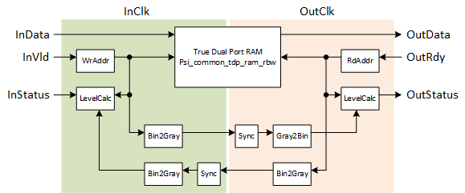

***

[**component list**](../README.md)

# psi_common_async_fifo
 - VHDL source: [psi_common_async_fifo](../../hdl/psi_common_async_fifo.vhd)
 - Testbench source: [psi_common_async_fifo_tb.vhd](../../testbench/psi_common_async_fifo_tb/psi_common_async_fifo_tb.vhd)

### Description

This component implements an asynchronous FIFO (different clocks for write and read port). The memory is described in a way that it utilizes RAM resources (Block-RAM) available in FPGAs with commonly used tools.

The FIFO is a fall-through FIFO and has AXI-S interfaces on read and write side.

The RAM behavior (read-before-write or write-before-read) can be selected. This allows efficiently implementing FIFOs for different technologies (some technologies implement one, some the other behavior).


### Generics
| Name            | type      | Description                                          |
|:----------------|:----------|:-----------------------------------------------------|
| width_g         | positive  | Width of the FIFO|
| depth_g         | positive  | Depth of the FIFO|
| afull_on_g      | boolean   | **True** = Almost full output is provided, **False** = Almost full output is omitted|
| afull_lvl_g     | natural   | Almost full output is high if the level is \>= AlmFullLevel\_g|
| aempty_on_g     | boolean   | True = Almost empty output is provided, False = Almost empty output is omitted|
| aempty_level_g  | natural   | Almost empty output is high if the level is \<= AlmFullLevel\_g|
| ram_style_g     | string    | **"auto"** (default) Automatic choice of block- or distributed-RAM **"distributed"** Use distributed RAM (LUT-RAM), **"block"** Use block RAM|
| ram_behavior_g  | string    | **"RBW"** Read-before-write implementation, **"WBR"** Write-before-read implementation|
| rdy_rst_state_g | std_logic | State of *InRdy* signal during reset. Usually this does not play a role and the default setting ('1') that leads to the least logic on the InRdy path is fine. Setting the value to '0' may lead to less optimal performance in terms of FMAX.|
| rst_pol_g       | std_logic | reset polarity, '1' high active & '0' low active|


### Interfaces

| Name         | In/Out   | Length   | Description   |
|:-------------|:---------|:---------|:--------------|
| in_clk_i     | i        | 1        | Write side clock    |
| in_rst_i     | i        | 1        | Write side reset input (active high)   |
| out_clk_i    | i        | 1        | Read side clock|
| out_rst_i    | i        | 1        | Read side reset  input (active high)  |
| in_dat_i     | i        | width_g  | Write data      |
| in_vld_i     | i        | 1        | AXI-S  handshaking signal|
| in_rdy_o     | o        | 1        | AXI-S  handshaking signal|
| out_dat_o    | o        | width_g  | Read data       |
| out_vld_o    | o        | 1        | AXI-S  handshaking signal          |
| out_rdy_o    | i        | 1        | AXI-S handshaking signal  |
| in_full_o    | o        | 1        | FIFO full signal synchronous to *in_clk_i*     |
| in_empty_o   | o        | 1        | FIFO empty signal synchronous to *in_clk_i*    |
| in_afull_o   | o        | 1        | FIFO almost full signal synchronous to *in_clk_i*, Only exists if *AlmFullOn\_g*  = true      |
| in_aempty_o  | o        | 1        | FIFO almost empty signal synchronous to *in_clk_i*, Only exists if   *AlmEmptyOn\_g* = true|
| in_lvl_o     | o        | log2(depth_g)  | FIFO level synchronous to  *in_clk_i*         |
| out_full_o   | o        | 1        | FIFO full  signal  synchronous to *out_clk_i*   |
| out_empty_o  | o        | 1        | FIFO empty signal   synchronous to *out_clk_i*        |
| out_afull_o  | o        | 1        | FIFO almost full signal synchronous to *out_clk_i* Only exists if *AlmFullOn\_g* = true       |
| out_aempty_o | o        | 1        | FIFO almost   empty signal  synchronous to *out_clk_i*  Only exists if  *AlmEmptyOn\_g* = true|
| out_lvl_o    | o        | log2(depth_g)  | FIFO level synchronous to   *out_clk_i*          |


The rough architecture of the FIFO is shown in the figure below. Note that the figure does only depict the general architecture and not each and every detail.

Read and write address counters are handled in their corresponding clock domain. The current address counter value is then transferred to the other clock-domain by converting it to gray code, synchronizing it using a double-stage synchronizer and convert it back to a two's complement number. This approach ensures that a correct value is received, even if the clock edges are aligned in a way that causes metastability on the first flip-flop. Because the data is transferred in gray code, in this case either the correct value before an increment of the counter or the correct value after the increment is received, so the result is always correct.

All status information is calculated separately in both clock domains to make it available synchronously to both clocks.

This architecture is independent of the FPGA technology used and can also be used to combine more than just one Block-RAM into one big FIFO.

<p align="center">

</p>

### Constraints

For the FIFO to work correctly, signals from one clock domain to the other must be constrained to have not more delay that one clock cycle of the faster clock.

Example with a 100 MHz clock (10.0 ns period) and a 33.33 MHz clock (30 ns period) for Vivado:

```tcl
set_max_delay --datapath_only --from <ClkA> -to <ClkB> 10.0
set_max_delay --datapath_only --from <ClkB> -to <ClkA> 10.0
```

[**component list**](../README.md)
