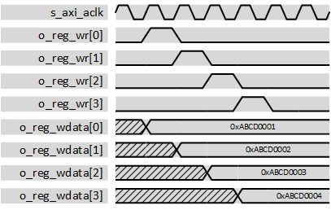
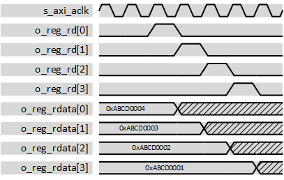
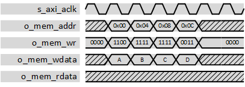
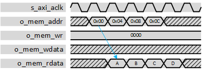

***

[**component list**](../README.md)

# psi_common_axi_slave_ipif

 - VHDL source: [psi_common_axi_slave_ipif](../../hdl/psi_common_axi_slave_ipif.vhd)
 - Testbench source: [psi_common_axi_slave_ipif_tb.vhd](../../testbench/psi_common_axi_slave_ipif_tb/psi_common_axi_slave_ipif_tb.vhd)

**64 bits support**
 - VHDL source: [psi_common_axi_slave_ipif64.vhd](../../hdl/psi_common_axi_slave_ipif64.vhd)
 - Testbench: [psi_common_axi_slave_ipif64_tb.vhd](../../testbench/psi_common_axi_slave_ipif64_tb) *(require library **psi_tb** release 2.6.0)*

### Description

The description has been written for original 32 bits support, the 64 bits IP block doesn't have a dedicated description but it is essentially what is presented here below.

This entity implements a full AXI-4 slave interface that can be used to make custom IP-Cores accessible through AXI.

On the user interface (where the user code is attached), it supports using registers as well as access to synchronous memory (e.g. BRAMs). Burst are supported, also across the boundary between registers and memory range.

The limitations of this block are given below:

-   It cannot be operated with memory only (at least 1 register must be
    used)

-   The number of registers must be a power of two

-   The latency of memory attached must be exactly one clock cycle

-   AXI bus width is fixed to 32-bits

Especially the limitation of the memory latency to one clock cycle is suboptimal, since this prevents any additional pipelining in large IP-Cores.

For registers, this entity handles read/write registers completely independently. If readback of register values written via AXI should be possible, the user code must loop-back write values (*o\_reg\_wdata*) to read values (*i\_reg\_rdata*).

The memory range is placed in the memory map directly after the registers. Example: If 8 registers are implemented, the registers are at AXI addresses 0x00, 0x04, ... 0x1C and memory starts at the AXI address 0x20.

The offset of the memory is removed internally. So in the example above, an access to the AXI address 0x24 (second memory cell) leads to the memory address (*o\_mem\_addr)* 0x04 because the offset of 0x20 is subtracted in the *psi\_common\_axi\_slave\_ipif* component.

### IP Interface transactions

Only burst transactions of length 4 are shown in the waveforms for simplicity reasons. Single word transactions behave the same as length 1 bursts.

For all waveforms, an implementation with 4 registers (*NumReg\_g* = 4) is assumed. Hence the memory range starts at address 0x10.

#### Register Write

When a register is written, a pulse on the corresponding *o\_reg\_wr* signal is asserted together with the new data value.

 Register Write 

#### Register Read

When a register is read, its value is sampled together with the pulse being applied on the corresponding *o\_reg\_rd* signal. Hence he *o\_reg\_rd* signal can for example be used to acknowledge reading from a FIFO.

 Register Read 

#### Memory Write

In this example, data in the AXI-addresses 0x12 ... 0x1D is written. Since the example assumes four registers (addresses 0x00 ... 0x0F), this translates to memory addresses 0x02 ... 0x0D on the user interface, because the memory offset of 0x10 is subtracted internally.

 Memory write Read 

#### Memory Read

In this example, data in the AXI-addresses 0x10 ... 0x1F is read. Since the example assumes four registers (addresses 0x00 ... 0x0F), this translates to memory addresses 0x01 ... 0x0F on the user interface, because the memory offset of 0x10 is subtracted internally.

The example also nicely shows, that read data must be applied after exactly one clock cycle.

 Memory Read 

#### Write over Register/Memory Boundary

In this example, four data words are written to the addresses 0x08 ... 0x17. This includes two registers and two memory locations. Note that the register and memory interfaces are not delay compensated, therefore the first memory access happens at the same time as the last register access.

 Write over register boundary 

### Generics
| Name             | type     | Description                               |
|:-----------------|:---------|:------------------------------------------|
| num_reg_g        | integer  | Number of registers to implement                       
| rst_val_g        | t_aslv32 | Reset values for registers. The size of the array passed does not have to match NumReg_g, if it does not, the reset values are applied to the first N registers and the other registers are reset to zero.
| use_mem_g        | boolean  | **True** = use memory interface, **False** = use registers only
| axi_id_width_g   | integer  | Number of bits used for the AXI ID signals
| axi_addr_width_g | integer  | Number of AXI address bits supported

### Interfaces
| Name          | In/Out   | Length           | Description                                    |
|:--------------|:---------|:-----------------|:-----------------------------------------------|
| s_axi_*    		| N.A      | N.A              | AXI Slave interfaces				                   |
| o_reg_rd      | o        | num_reg_g        | Read-pulse for each register
| o_reg_wr      | o        | num_reg_g        | Write-pulse for each register             
| i_reg_rdata   | i        | num_reg_g        | Register read values  
| o_reg_wdata   | o        | 2                | Register write values              
| o_mem_addr    | o        | axi_addr_width_g | Memory address             
| o_mem_wr      | o        | 4                | Memory byte write enables ()one signal per byte)             
| o_mem_wdata   | o        | 32               | Memory write data  
| i_mem_rdata   | i 			 | 32								| Memory read data            

[**component list**](../README.md)
