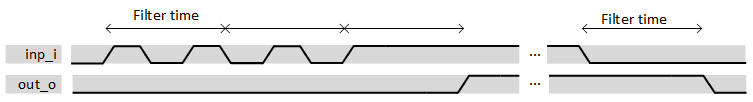

***

[**component list**](../README.md)

# psi_common_debouncer
 - VHDL source: [psi_common_debouncer](../../hdl/psi_common_debouncer.vhd)
 - Testbench source: [psi_common_debouncer_tb.vhd](../../testbench/psi_common_debouncer_tb/psi_common_debouncer_tb.vhd)

### Description

This component is a simple de-bouncer element where the filter time period is settable via generic as well as the polarity of both input and
output. If the input is toggling during less time than the one set as generic in sec. the output won't be forwarded to the output. The counter
start is triggered via the input change of state, once the counter reach the time predefined the output value is then forwarded depending on the
desired polarity.

 

 datagram if len_g = 1 

### Generics
| Name               | type      | Description           |
|:-------------------|:----------|:----------------------|
| generic(dbnc_per_g | real      | filter time in sec    |
| freq_clk_g         | real      | clock frequency in hz |
| rst_pol_g          | std_logic | polarity reset        |
| len_g              | positive  | vector input lenght   |
| in_pol_g           | std_logic | active high or low    |
| out_pol_g          | std_logic | active high or low    |
| sync_g             | boolean   | add 2 dff input sync  |

### Interfaces
| Name   | In/Out   | Length   | Description   |
|:-------|:---------|:---------|:--------------|
| clk_i  | i        | 1        | system clock  |
| rst_i  | i        | 1        | system rst    |
| dat_i  | i        | len_g    | dat input     |
| dat_o  | o        | len_g    | dat output    |

[**component list**](../README.md)
