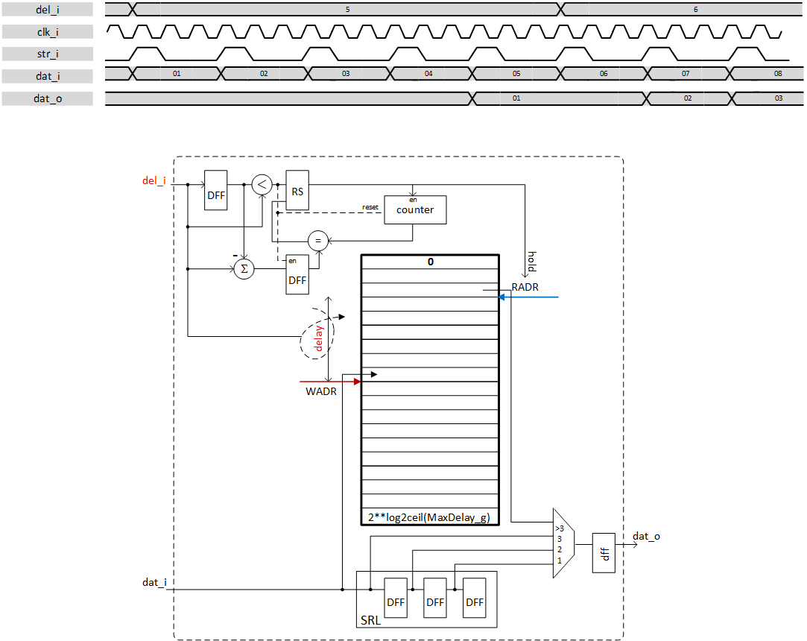

***

[**component list**](../README.md)

# psi_common_delay_cfg
 - VHDL source: [psi_common_delay_cfg](../../psi_common/hdl/psi_common_delay_cfg.vhd)
 - Testbench source: [psi_common_delay_cfg_tb.vhd](../../testbench/psi_common_delay_cfg_tb/psi_common_delay_cfg_tb.vhd)

### Description

This component is slightly the same as the [psi_common_delay](psi_common_delay.md) but it is configurable during runtime. It
allows setting the delay by a register. The architecture is based on block RAM and a SRL an overview is shown on next figure.

Since the latency is set by 3 registers to write, to read from block ram and to output the value a small shift register is implemented to output
value when delay is inferior or equal to 3.

The delay value 0 isn't covered it will by default have a minimum of one clock cycle delay.

A generic allows to hold the value when a change is done to increase delay, this avoid having transient for example. A counter is launched to
compute the delay difference and read address is hold during this time. This behavior can be skipped.

 

 Hold behavior & pseudo-architecture 

### Generics
| Name            | type      | Description                                              |
|:----------------|:----------|:---------------------------------------------------------|
| width_g 				| positive  | data vector width                                        |
| max_delay_g     | positive  | maximum delay wanted                                     |
| rst_pol_g       | std_logic | reset polarity                                           |
| ram_behavior_g  | string    | "rbw" = read-before-write, "wbr" = write-before-read     |
| hold_g          | boolean   | holding value at output when delay increase is performed |

### Interfaces
| Name   | In/Out   | Length       | Description               |
|:-------|:---------|:-------------|:--------------------------|
| clk_i  | i        | 1            | system clock              |
| rst_i  | i        | 1            | system reset              |
| dat_i  | i        | width_g      | data input                |
| vld_i  | i        | 1            | valid/strobe signal input |
| del_i  | i        | max_delay_g  | delay parameter input     |
| dat_o  | o        | width_g      | data output               |
| vld_o  | o   			| 1   				 | valid/strobe output output|

[**component list**](../README.md)
