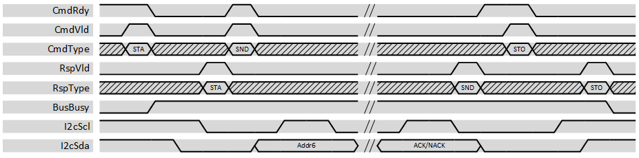

***

[**component list**](../README.md)

# psi_common_i2c_master
 - VHDL source: [psi_common_i2c_master](../../hdl/psi_common_i2c_master.vhd)
 - Testbench source: [psi_common_i2c_master_tb.vhd](../../testbench/psi_common_i2c_master_tb/psi_common_i2c_master_tb.vhd)

### Description

This entity implements an I2C master that is multi-master capable (i.e. supports arbitration). The *psi\_common\_i2c\_master* allows generating
start, stop and repeated start conditions as well as transferring bytes. This entity also supports slaves that do clock-stretching.

Addressing is not handled separately. To send the byte containing the address and the R/W bit, the normal byte transfer is used. The user is
responsible for filling the address into bits 7:1 and the R/W flag into bit 0 of the data.

The same applies for 10-bit addressing. The user is responsible to send the 10-bit addressing pattern using two byte transfers.

The bus state (busy or free) is tracked based on start- and stop-conditions. However, if no transactions are ongoing (i.e. SCL = '1'
and SDA = '1') for a configurable timeout, the bus is always regarded as free. This helps handling the case where a master starts a transaction
and then (e.g. due to reset) aborts the transaction without sending a stop-condition.

The user has three main interfaces:

-   The command interface allows the user to select the next bus action
    to do. Commands are:

    -   *START* Send a start condition (only allowed if bus is idle)

    -   *STOP* Send a stop condition (only allowed if bus is not idle)

    -   *REPSTART* Send a repeated start condition (only allowed if the
        bus is not idle)

    -   *SEND* Send a data byte (only allowed if the bus is not idle).\
        The data to send is provided along with the command.

    -   *REC* Receive a data byte (only allowed if the bus is not idle)\
        The ACK to send is provided along with the command.

-   On the response interface, the user receives one response per command as soon as the command is completed. More information like
    the received ACK bit, whether the command was aborted due to a lost arbitration, the received data or whether the command sequence was
    illegal is sent along with the response.

-   On the status interface the user can see if the I2C bus is currently busy or free and if a command timed out (i.e. the user failed to
    provide the next command within time, so the bus was released).

For constants, a package *psi\_common\_i2c\_master\_pkg* is defined in
the same VHDL file.

### Generics

Generics                | Description
------------------------|-----------------------------------------------------
clock_frequency_g      | Frequency of the clock *Clk* in Hz\
i2c_frequency_g        | Frequency of the *I2cScl* signal in Hz\
bus_busy_timeout_g     | If *I2cScl* = '1' and *I2cSda* = '1' for this time in sec., the bus is regarded as free. If the user does not provide any command for this time, the *psi\_common\_i2c\_master* automatically generates a stop-condition to release the bus.
cmd_timeout_g          | When the *psi\_common\_i2c\_master* is ready for the next command but the user does not provide a new command, after this timeout the bus is releases (and *TimeoutCmd* is pulsed to inform the user).
internal_tri_state_g   | **True** = Use internal tri-state buffer (*I2cScl* and *I2cSda*) are used. **False** = Use external tri-state buffer (*I2cScl\_x* and *I2cSda\_x*) are used.
disable_asserts_g      | If true, the *psi\_common\_i2c\_master* does not print any messages during simulations
rst_pol_g               | '1' active high, '0' active low

### Interfaces
Signal                 | Direction | Width | Description           
-----------------------|-----------|-------|-------------------------
 ***Control Signals*** |           |       |                       
 clk_i                   | Input     | 1     | Clock                 
 rst_i                   | Input     | 1     | Reset (high active)   
 ***Command Interface*** |         |       |                       
 cmd_rdy_o                 | Output    | 1     | AXI-S handshakingsignal for commandinterface
 cmd_vld_i                 | Input     | 1     | AXI-S handshaking signal for command   interface           
 cmd_type_i                | Input     | 3     | Constant names "000" =\> Send startcondition (*CMD\_START*)"001" =\> Send stop condition(*CMD\_STOP)* "010" =\> Send repeated start condition"  (*CMD\_REPSTART)*   "011" =\> Send data  byte (*CMD\_SEND)* "100" =\> Receive data byte  (*CMD\_RECEIVE)*      
 cmd_dat_i                 | Input     | 8 | Input data to send (only for *CMD\_SEND*  resp. *CmdType="011"*).     
 cmd_ack_i                 | Input     | 1     | Acknowledge to send (only for *CMD\_RECEIVE* resp. *CmdType="100").*     
 ***Response Interface***  |       |       |                      
 rsp_vld_o               | Output    | 1     | AXI-S handshaking signal for response interface           
 rsp_type_o              | Output    | 3     | Type of the command that completed. See *CmdType* for details.              
 rsp_dat_o               | Output    | 8     | Received data (only for *CMD\_RECEIVE* resp.  *CmdType="100"*).    
 rsp_ack_o               | Output    | 1     | **1** =\> ACK received, **0** =\> NACK received   
 rsp_arb_lost_o          | Output    | 1     | The command failed because arbitration was lost
 rsp_seq_o               | Output    | 1     | The command failed because of wrong command sequence(e.g. attempt to do a*CMD\_START* in the middle of an ongoing transfer)
 ***Status Interface*** |           |       |                       
 bus_busy_o               | Output    | 1     | I2C bus is busy (used by this master or another master)  
 TimeoutCmd            | Output    | 1     | Pulsed if the bus is released due to a timeout.              
 ***I2C Interface -- Internal Tristate (InternalTriState\_g=true)***    ||||
 i2c_scl_io                | Bidir     | 1     | SCL signal            
 i2c_sda_io                | Bidir     | 1     | SDA signal            
 ***I2C Interface External Tristate (Internal TriState\_g=false)***     ||||                    
 i2c_scl_i             | Input     | 1     | SCL input signal      
 i2c_scl_o             | Output    | 1     | SCL output signal     
 i2c_scl_t             | Output    | 1     | SCL Tri-State signal (1 = tristated, 0 drive)                
 i2c_sda_i             | Input     | 1     | SDA input signal      
 i2c_sda_o             | Output    | 1     | SDA output signal     
 i2c_sda_t             | Output    | 1     | SDA Tri-State signal (1 = tristated, 0 drive)

 ### Typical Command Sequences

 This section provides a few examples for command/response sequences for
 typical use cases.

 Note that the response of the last command is always available before
 the next command must be asserted. So it is possible to apply commands
 based on responses received (e.g. not applying a new command if
 arbitration was lost).

 #### Two Byte Read

 -   CMD\_START -- send start condition
 -   CMD\_SEND -- send address byte (slave responds with ACK)
 -   CMD\_REC -- receive data and send ACK
 -   CMD\_REC -- receive data and send NACK
 -   CMD\_STOP -- send stop condition

 **Order**   |**CmdType**  | **CmdData**   |**CmdAck**   |**RspType**   |**RspData**   |**RspAck**   |**RspArbLost**   |**RespSeq**
  -----------|-------------|---------------|-------------|--------------|--------------|-------------|-----------------|-------------
   1         |  CMD\_START |   N/A         |  N/A        |  CMD\_START  |  N/A         |  N/A        |  0              |  0
   2         |  CMD\_SEND  |   Addr + R/W  |  N/A        |  CMD\_SEND   |  N/A         |  1          |  0              |  0
   3         |  CMD\_REC   |   N/A         |  1          |  CMD\_REC    |  Data        |  N/A        |  0              |  0
   4         |  CMD\_REC   |   N/A         |  0          |  CMD\_REC    |  Data        |  N/A        |  0              |  0
   5         |  CMD\_STOP  |   N/A         |  N/A        |  CMD\_STOP   |  N/A         |  N/A        |  0              |  0          

 ### Two Byte Write

 -   CMD\_START -- send start condition
 -   CMD\_SEND -- send address byte (slave responds with ACK)
 -   CMD\_SEND -- send data (slave responds with ACK)
 -   CMD\_SEND -- send data (slave responds with NACK)
 -   CMD\_STOP -- send stop condition

 **Order**   |  **CmdType**|  **CmdData**|  **CmdAck**|  **RspType**|  **RspData**|  **RspAck**|  **RspArbLost**|  **RespSeq**
 ------------|-------------|-------------|------------|-------------|-------------|------------|----------------|-------------
 1           |CMD\_START   |N/A          |N/A         |CMD\_START   |N/A          |N/A         |0               |0
 2           |CMD\_SEND    |Addr + R/W   |N/A         |CMD\_SEND    |N/A          |1           |0               |0
 3           |CMD\_SEND    |Data         |N/A         |CMD\_SEND    |N/A          |1           |0               |0
 4           |CMD\_SEND    |Data         |N/A         |CMD\_SEND    |N/A          |0           |0               |0
 5           |CMD\_STOP    |N/A          |N/A         |CMD\_STOP    |N/A          |N/A         |0               |0

 ### One Byte Write followed by One Byte Read (with Repeated Start)

 -   CMD\_START -- send start condition
 -   CMD\_SEND -- send address byte (slave responds with ACK)
 -   CMD\_SEND -- send data (slave responds with ACK)
 -   CMD\_REPSTART -- Repeated start
 -   CMD\_REC -- receive data and send NACK
 -   CMD\_STOP -- send stop condition

 Order  |CmdType  |CmdData  |CmdAck  |RspType  |RspData  |RspAck  |RspArbLost  | RespSeq
 -------|---------|---------|--------|---------|---------|--------|------------|---------
 1      |CMD\_START   |N/A          |N/A         |CMD\_START   |N/A          |N/A         |0               |0
 2      |CMD\_SEND    |Addr + R/W   |N/A         |CMD\_SEND    |N/A          |1           |0               |0
 3      |CMD\_SEND    |Data         |N/A         |CMD\_REC     |N/A          |1           |0               |0
 4      |CMD\_REPST.  |N/A          |N/A         |CMD\_REPST.  |N/A          |N/A         |0               |0
 4      |CMD\_REC     |N/A          |0           |CMD\_REC     |Data         |N/A         |0               |0
 5      |CMD\_STOP    |N/A          |N/A         |CMD\_STOP    |N/A          |N/A         |0               |0

 #### Arbitration Lost

 -   CMD\_START -- send start condition
 -   CMD\_SEND -- send address byte (slave responds with ACK)
 -   CMD\_SEND -- send data (arbitration is lost during this byte)
 -   CMD\_REPSTART -- Repeated start
 -   This command is ignored (RespSeq='1') because it is illegal when the bus is not owned

 **Order** |  **CmdType** |  **CmdData** |  **CmdAck** |  **RspType** |  **RspData** |  **RspAck** |  **RspArbLost** |  **RespSeq**
 ----------|-------------|-------------|------------|-------------|-------------|------------|----------------|-------------
 1         |CMD\_START   |N/A          |N/A         |CMD\_START   |N/A          |N/A         |0               |0
 2         |CMD\_SEND    |Addr + R/W   |N/A         |CMD\_SEND    |N/A          |1           |0               |0
 3         |CMD\_SEND    |Data         |N/A         |CMD\_REC     |N/A          |N/A         |1               |0
 4         |CMD\_REPST.  |N/A          |N/A         |CMD\_REPST.  |N/A          |N/A         |0               |1

 ### Example Waveform

 The waveform below shows the very simplest transaction possible:
 transmitting an address only to probe if the slave is available. This simple transaction was chosen to keep the waveform as short as possible.  The main focus is on the sequence of events, not on the I2C transaction.

 

 
 Address only transaction 

 [**component list**](../README.md)
