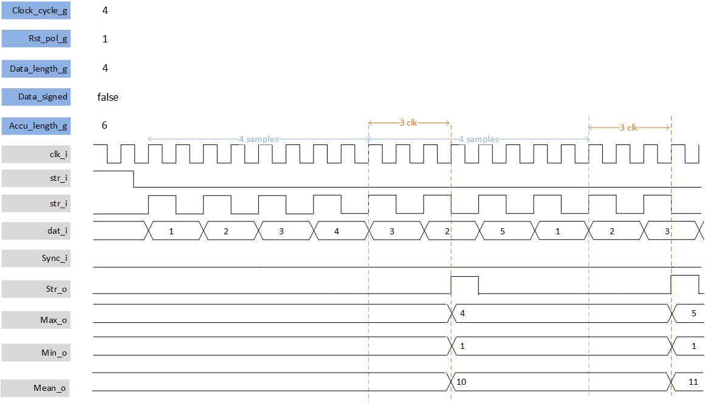

***

[**component list**](../README.md)

# psi_common_min_max_sum
 - VHDL source: [psi_common_min_max_sum](../../hdl/psi_common_min_max_sum.vhd)
 - Testbench source: [psi_common_min_max_sum_tb.vhd](../../testbench/psi_common_min_max_sum_tb/psi_common_min_max_sum_tb.vhd)

### Description

This component provides for a given time period **clock_cycle_g**, the minimum, the maximum and the accumulator of a single channel data stream. The stream can be synchronized with external input. In order to get average/mean value, output vector sum needs to be divided by the number required data sample; **clock_cycle_g** defines the number of samples.

 

### Generics
| Name                  | type      | Description                      |
|:----------------------|:----------|:---------------------------------|
| generic(clock_cycle_g | positive  | clock cycle for accumulator time |
| signed_data_g         | boolean   | data signed/unsigned             |
| data_length_g         | natural   | data length                      |
| accu_length_g         | natural   | mean output length               |
| rst_pol_g             | std_logic | polarity reset                   |

### Interfaces
| Name   | In/Out   | Length          | Description               |
|:-------|:---------|:----------------|:--------------------------|
| clk_i  | i        | 1               | clock                     |
| rst_i  | i        | 1               | reset                     |
| str_i  | i        | 1               | input strobe/valid        |
| sync_i | i        | 1               | input to sync measurement |
| dat_i  | i        | data_length_g   | input data                |
| str_o  | o        | 1               | output strobe/valid       |
| min_o  | o        | data_length_g   | output min val            |
| max_o  | o        | data_length_g   | output max val            |
| sum_o  | o        | accu_length_g-1 | output vector sum         |

[**component list**](../README.md)
