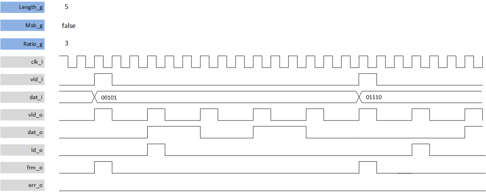
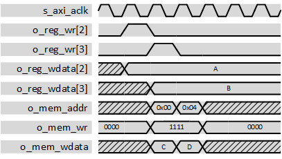

***

[**component list**](../README.md)

# psi_common_par_ser
 - VHDL source: [psi_common_par_ser](../../hdl/psi_common_par_ser.vhd)
 - Testbench source: [psi_common_par_ser_tb.vhd](../../testbench/psi_common_par_ser_tb/psi_common_par_ser_tb.vhd)

### Description
This component implements a serializer from a vector, the user indicates either the MSB either LSB are forwarded first with MSB_g generic. The serializer can run at full/clock speed  under one condition is that the input data is sampled at N times lower than the serialized bit where N is the vector input length; if a valid input arrives before this time an error flag is aroused.
Additionally a frame output flag is given at the last serialized bit and a load output is also given at the first output bit. The valid stays high for one clock cycle at each new bit produced.

#### throughput divided by 3 related to clock cycle frequency

#### highest throughput datagram

### Generics
| Name              | type      | Description                         |
|:------------------|:----------|:------------------------------------|
| generic(rst_pol_g | std_logic | reset polarity                      |
| msb_g             | boolean   | msb first in the frame              |
| ratio_g           | natural   | output valid speed related to clock |
| length_g          | natural   | vetor in width                      |

### Interfaces
| Name   | In/Out   | Length   | Description                         |
|:-------|:---------|:---------|:------------------------------------|
| clk_i  | i        | 1        | clock system                        |
| rst_i  | i        | 1        | reset system                        |
| dat_i  | i        | length_g | data in parallel                    |
| vld_i  | i        | 1        | valid/strobe/load in                |
| dat_o  | o        | 1        | data out serialized                 |
| err_o  | o        | 1        | error out when input valid too fast |
| frm_o  | o        | 1        | frame out                           |
| ld_o   | o        | 1        | start of frame out                  |
| vld_o  | o        | 1        | valid/strobe                        |

[**component list**](../README.md)
