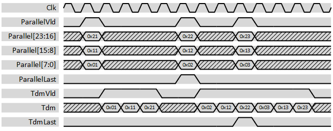

***

[**component list**](../README.md)

# psi_common_par_tdm
 - VHDL source: [psi_common_par_tdm](../../hdl/psi_common_par_tdm.vhd)
 - Testbench source: [psi_common_par_tdm_tb.vhd](../../testbench/psi_common_par_tdm_tb/psi_common_par_tdm_tb.vhd)

### Description

This component changes the representation of multiple channels from parallel to time-division-multiplexed. It does not implement any flow-control, so the user is responsible to not apply input data faster than it can be represented at the output (time-division-multiplexed).

The figure below shows some waveforms of the conversion. The lowest bits of the input vector are interpreted as channel 0 and played out first, the highest bits of the input vector are played out last.

  

### Generics
| Name            | type      | Description      |
|:----------------|:----------|:-----------------|
| channel_count_g | natural   | maximum number of channel 		 |
| channel_width_g | natural   | vector length per channel  		 |
| rst_pol_g       | std_logic |'1' active high, '0' active low |

### Interfaces
| Name   | In/Out   | Length          | Description               																 |
|:-------|:---------|:----------------|:-----------------------------------------------------------|
| clk_i  | i        | 1               | system clock   																						 |
| rst_i  | i        | 1               | system reset       																				 |
| dat_i  | i        | channel_count_g | DATA big vector interpreted as // input                    |
| vld_i  | i        | 1               | valid input                         											 |
| rdy_o  | o        | 1               | rdy output - push back                           					 |
| last_i | i   			| 1   						| AXI-S TLAST signal, set for the last transfer in a packet  |
| dat_o  | o        | channel_width_g | DATA output in TDM fashion                         |
| vld_o  | o        | 1               | AXI-S handshaking signal                        |
| rdy_i  | i   			| 1  						  | rdy input - push back   |
| last_o | o        | 1               | AXI-S TLAST signal, set for the last transfer in a packet                       |

[**component list**](../README.md)
