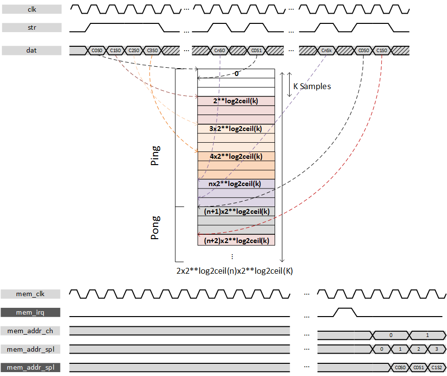

***

[**component list**](../README.md)

# psi_common_ping_pong
 - VHDL source: [psi_common_ping_pong](../../psi_common_ping_pong.vhd)
 - Testbench source: [psi_common_ping_pong_tb.vhd](../../testbench/psi_common_ping_pong_tb/psi_common_ping_pong_tb.vhd)

### Description

This component implements a ping pong buffer mechanism around a ***single*** RAM block for multiple channels. It allows to stream data
continuously in moving data back and forth at different memory space.
While a buffer 'Ping' is written the other 'Pong' can be read. An interrupt is delivered when the buffer writing address swap, it gives
the start indication to read.

The ***memory split between*** "buffers" which correspond to channels is defined as follow: the memory space necessary for one single channel
will be extracted from the number of samples to be transferred and will be ceiled to its ***power of 2***. This means gaps may occur if one
choose to forward 500 samples a memory fragmentation of 12 samples per canal is to be expected. This choice has been to ease the genericity of the component and its implementation. At the read port it is possible to
select channel independent from sample. The ping pong component allows either receiving data in parallel either as time division multiplexed.
Fig. 39 gives an overview of the TDM behavior whereas the next figure shows the TDM mode.

If user wants to use a single channel then the parallel mode is required.

**Beware** that data sample frequency ratio compared to the clock cannot be higher than the number of channel. It is not feasible to
several channels simultaneously, in other words **only one sample per 'number of channels' clock cycles**. An associated test
bench helps to determinate proper parameters.

---

 TDM mode 

---

 Parallel mode 

---

Both figures shows hypothetical behaviors for ping pong buffer and the
following convention applies:

-   C: channel
-   S: sample
-   C0S1: Channel 0 & sample 1

### Generics
| Name            | type      | Description                        |
|:----------------|:----------|:-----------------------------------|
| ch_nb_g 				| natural   | channel number -> master 8         |
| sample_nb_g     | natural   | sample number per memory space     |
| dat_length_g    | positive  | data width in bits                 |
| tdm_g           | boolean   | tdm* behavior if false par         |
| ram_behavior_g  | string    | ram behavior "rbw"|"wbr" -> cf ram |
| rst_pol_g       | std_logic | reset polarity                     |

### Interfaces
| Name           | In/Out   | Length       | Description                                   |
|:---------------|:---------|:-------------|:----------------------------------------------|
| clk_i          | i        | 1            | clock data                                    |
| rst_i          | i        | 1            | rst data                                      |
| dat_i          | i        | tdm_g,       | data input                                    |
| str_i          | i        | ie           | strobe input (ie valid)                       |
| mem_irq_o      | o        | 1            | indicate when a set of buffer has been filled |
| mem_clk_i      | i        | 1            | clock mem                                     |
| mem_addr_ch_i  | i        | ch_nb_g      | channel selection for mem read                |
| mem_addr_spl_i | i        | sample_nb_g  | sample selection for mem read                 |
| mem_dat_o      | o        | dat_length_g | data mem read                                 |

[**component list**](../README.md)
