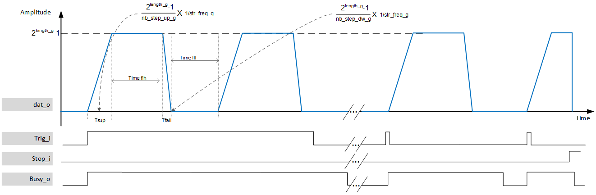

***

[**component list**](../README.md)

# psi_common_pulse_generator_ctrl_static
 - VHDL source: [psi_common_pulse_generator_ctrl_static](../../hdl/psi_common_pulse_generator_ctrl_static.vhd)
 - Testbench source: [psi_common_pulse_generator_ctrl_static_tb.vhd](../../testbench/psi_common_pulse_generator_ctrl_static_tb/psi_common_pulse_generator_ctrl_static_tb.vhd)

### Description

This component implements a pulse generator with static parameters via generics. It create pulses from 0 to the max value defined by the vector data length. The user can set the rising time, the flat top duration and the falling time. The component is responsive to the trigger input (_edge detection_), however if the signal is left to '1' then the block will perform consecutive pulses with the selected parameters. Another parameter allow to define the time duration when a pulse returns to 0.
During a full cycle, from ramping up, flat top, ramping down and return 0 for the time duration set the component is busy and will not react to another trigger input.

### Generics
| Name              | type      | Description                             |
|:------------------|:----------|:----------------------------------------|
| rst_pol_g 			  | std_logic |'1' active high, '0' active low          |
| length_g          | natural   | output data vector length               |
| clk_freq_g        | real      | clock frequency in hz                   |
| str_freq_g        | real      | strobe output || increment strobe in hz |
| nb_step_up_g      | integer   | ramp up param step in str               |
| nb_step_dw_g      | integer   | ramp down param step in str             |
| nb_step_flh_g     | integer   | flat level param step in str            |
| nb_step_fll_g     | integer   | low level param step in str             |

### Interfaces
| Name   | In/Out   | Length     | Description                                          |
|:-------|:---------|:-----------|:-----------------------------------------------------|
| clk_i  | i        | 1          | clock                                                |
| rst_i  | i        | 1          | reset                                                |
| trig_i | i        | 1          | trigger a new pulse                                  |
| stop_i | i        | 1          | abort pulse                                          |
| busy_o | o        | 1          | pulse in action                                      |
| dat_o  | o        | length_g   | pulse output                                         |
| str_o  | o        | 1          | pulse strobe                                         |
| dbg_o  | o        | 1          | use for tb purpose and avoid using externalname ghdl |

[**component list**](../README.md)
