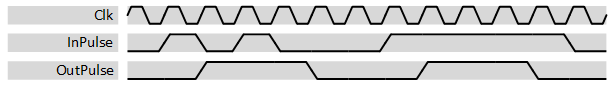

***

[**component list**](../README.md)

# psi_common_pulse_shaper
 - VHDL source: [psi_common_pulse_shaper]()../../hdl/psi_common_pulse_shaper.vhd)
 - Testbench source: [psi_common_pulse_shaper_tb.vhd](../../testbench/psi_common_pulse_shaper_tb/psi_common_pulse_shaper_tb.vhd)

### Description

This component creates pulses of an exactly known length from pulses with unknown length. Additionally it can limit the maximum pulse rate by applying a hold-off time.

Input pulses are detected based on their rising edge.

The figure below shows an example behavior for *Duration\_g=3* and *HoldOff\_g=4*. The first pulse is stretched to three cycles, the second pulse is ignored because it is within the hold-off time and the third pulse is shortened to three cycles.

 Example waveform 

### Generics
| Name       | type      | Description                                                                                                      |
|:-----------|:----------|:-----------------------------------------------------------------------------------------------------------------|
| duration_g | positive  | output pulse duration in clock cycles                                                                            |
| hold_in_g  | boolean   | hold input pulse to the output                                                                                   |
| hold_off_g | natural   | minimum number of clock cycles between input pulses, if pulses arrive faster, they are ignored $$ constant=20 $$ |
| rst_pol_g  | std_logic | reset polarity select                                                                                            |

### Interfaces
| Name   | In/Out   |   Length | Description                             |
|:-------|:---------|---------:|:----------------------------------------|
| clk_i  | i        |        1 | system clock $$ type=clk; freq=100e6 $$ |
| rst_i  | i        |        1 | system reset $$ type=rst; clk=clk $$    |
| dat_i  | i        |        1 | data in                                 |
| dat_o  | o        |        1 | data out                                |

[**component list**](../README.md)
