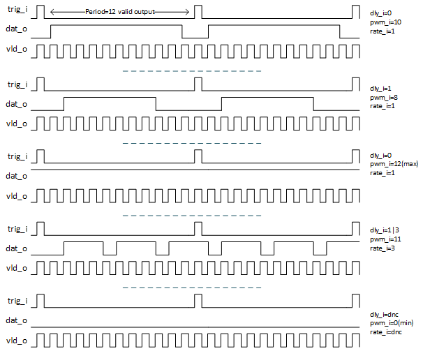

***

[**component list**](../ README.md)
# psi_common_pwm
 - VHDL source: [psi_common_pwm](../..//hdl/psi_common_pwm.vhd)
 - Testbench source: [psi_common_pwm_tb.vhd](../../testbench/psi_common_pwm_tb/psi_common_pwm_tb.vhd)

### Description
 It's a basic PWM generic that provide std_logic output, user defines few generic parameters and accordingly some command registers allows to produce  desired output.The signal  _rate_i_ increases the counter increment which allows generating several of pulses within a period with frequency set by generics _period_g_. In addition two comparators (not optimized for speed) allows adding delay _dly_i_ at pulse start and bring back to zero the output, settings are set in sample defines  by strobe frequency generics. Duty cycles is set via _pwm_i_ and is in strobe sample, one has to be aware that if rate increases then pwm_i should be accordingly.

 The following table shows different scenari, to generic is_sync_g allows to update parameters upon trigger's arrival. To set the ouput to zero _pwm_i_ shall be set to 0 and

### Generics
| Name               | type      | Description                                                            |
|:-------------------|:----------|:-----------------------------------------------------------------------|
| clk_freq_g 				 | natural   | clock frequency                                                        |
| str_freq_g         | natural   | strobe frequency                                                       |
| period_g           | real      | signal period                                                          |
| is_sync_g          | boolean   | sync paramter with trigger input is true or change on the fly if false |
| rst_pol_g          | std_logic | reset polarity                                                         |

### Interfaces
| Name   | In/Out   | Length      							| Description                                                          |
|:-------|:---------|:--------------------------|:---------------------------------------------------------------------|
| clk_i  | i        | 1           							| system clock                                                         |
| rst_i  | i        | 1           							| system reset                                                         |
| trig_i | i        | 1           							| trigger input, ideally same frequency that period generic            |
| rate_i | i        | log2(str_freq_g/period_g) | rate, increase pulse rate within a period, if set to 2 then 2 pulses |
| pwm_i  | i        | log2(str_freq_g/period_g) | pwm is equivalent to duty cycle but set in sample at str_freq        |
| dly_i  | i        | log2(str_freq_g/period_g) | allow delaying pulse start in sample at str_freq                     |
| dat_o  | o        | 1           							| data output, logic 'active high'                                     |
| vld_o  | o        | 1           							| vld output at str_freq rate                                          |
[**component list**](../ README.md)
