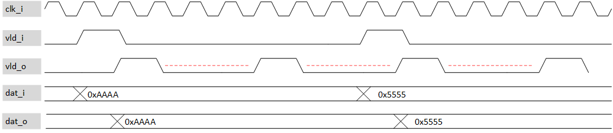

***

[**component list**](../README.md)

# psi_common_sample_rate_converter
 - VHDL source: [psi_common_sample_rate_converter.vhd](../../hdl/psi_common_sample_rate_converter.vhd)
 - Testbench source: [psi_common_sample_rate_converter_tb.vhd](../../testbench/psi_common_sample_rate_converter_tb/psi_common_sample_rate_converter_tb.vhd)

### Description

This block is converting the valid input strobe signal to a desired rate without any filter, the same block be mean of generic can produce over sampling signal output
or reduce sampling rate. For downsampling a pre filter is recommended and opposite for up sampling mode a post filter to smooth or interpolate is also advised.

### Generics
| Name                | type      | Description                                         |
|:--------------------|:----------|:----------------------------------------------------|
| RATE_g     				  | integer   | Sampling rate factor for up/down sampling           |
| MODE_g              | real      | "DOWN" => downsampling, "UP" => upsampling          |
| length_g            | positive  | data input length   in bit                          |
| CLK_TO_VALID_RATIO_g| positive  | Ratio between clock frequency and vld input frequency|
| rst_pol_g           | std_logic | polarity reset                                      |

### Interfaces
| Name    | In/Out   | Length              | Description     |
|:--------|:---------|:--------------------|:----------------|
| clk_i   | i        | 1                   | clock           |
| rst_i   | i        | 1                   | reset           |
| dat_i   | i        | length_g            | input data      |
| vld_i   | i        | 1                   | valid in        |
| dat_o   | o        | length_g            | data output     |
| vld_o   | o        | 1                   | valid output    |

[**component list**](../README.md)
