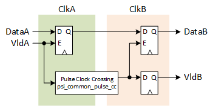

***

[**component list**](../README.md)


# psi_common_simple_cc
 - VHDL source: [psi_common_simple_cc](../../hdl/psi_common_simple_cc.vhd)
 - Testbench source: [psi_common_simple_cc_tb.vhd](../../testbench/psi_common_simple_cc_tb/psi_common_simple_cc_tb.vhd)

### Description

This component implements a clock crossing for transferring single
values from one clock domain to another (completely asynchronous
clocks). In both clock domains the valid samples are marked with a **Vld**
signal according to the AXI-S specification but back-pressure (**Rdy**) is
not handled.

**For the entity to work correctly, the data-rate must be significantly lower (4x lower) than the destination clock frequency.**


This entity does also do the clock-crossing for the reset by using
"asynchronously assert, synchronously de-assert" synchronizer chains and
applying all attributes to synthesize them correctly.


### Generics
| Name         | type      | Description   |
|:-------------|:----------|:--------------|
| data_width_g | positive  | Width of the data signal to implement the clock crossing for
| a_rst_pol_g  | std_logic | reset polarity a           |
| b_rst_pol_g  | std_logic | reset polairty b           |

### Interfaces
| Name    | In/Out   | Length       | Description   |
|:--------|:---------|:-------------|:--------------|
| a_clk_i | i        | 1            | Clock A
| a_rst_i | i        | 1            | Clock domain A reset input (active high)
| a_rst_o | o        | 1            | Clock domain A reset output (active high), active if *RstInA* or *RstInB* is asserted, de-asserted synchronously to *ClkA*
| a_dat_i | i        | data_width_g | Data signal input
| a_vld_i | i        | 1            | AXI-S handshaking signal
| b_clk_i | i        | 1            | Clock B
| b_rst_i | i        | 1            | Clock domain A reset input (active high)
| b_rst_o | o        | 1            | Clock domain B reset output (active high), active if *RstInA* or *RstInB* is asserted, de-asserted synchronously to *ClkA*
| b_dat_o | o        | data_width_g | Data signal output
| b_vld_o | o        | 1            | AXI-S handshaking signal


### Architecture

The concept of this clock crossing is to use *psi\_common\_pulse\_cc* for the clock crossing of the valid signal and latch the data signal on in both clock domains when it is valid. Since the data signal stays stored on the source clock domain, it if for sure valid when the *Vld*
signal arrives at the destination clock domain.

To ensure the clock crossing works, the next *Vld* signal is only allowed to arrive after the last one was processed. This is the reason for the maximum data rate allowed being limited to one quarter of the destination clock frequency.

<p align="center">  </p>

For details about the reset clock crossing, refer to [pulse cc](psi_common_pulse_cc.md).

### Constraints

For the entity to work correctly, signals from the source clock domain to the destination clock domain must be constrained to have not more delay that one clock cycle of the destination clock.

Example with a 100 MHz source clock (10.0 ns period) and a 33.33 MHz destination clock (30 ns period) for Vivado:

```tcl
set_max_delay --datapath_only --from <ClkA> -to <ClkB> 30.0
```

[**component list**](../README.md)
