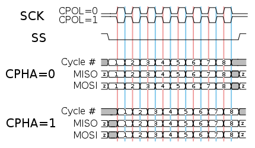
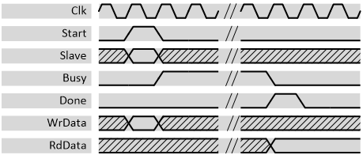

***

[**component list**](../README.md)

# psi_common_spi_master
 - VHDL source: [psi_common_spi_master](../../hdl/psi_common_spi_master.vhd)
 - Testbench source: [psi_common_spi_master_tb.vhd](../../testbench/psi_common_spi_master_tb/psi_common_spi_master_tb.vhd)

### Description

This entity implements a simple SPI master. All common SPI settings are
settable to ensure the master can be configured for different
applications.

The clock and data phase is configurable according to the SPI standard
terminology described in the picture below:

 

 CPOL and CPHA meaning 

For CPHA = 1, the sampling happens on the second edge (blue) and data is
applied on the first edge (red). For CPHA = 0 it is the opposite way.

### Generics
| Name              | type      | Description                                |
|:------------------|:----------|:-------------------------------------------|
| clk_div_g         | natural   | Ratio between *Clk* and the *SpiSck* frequency
| trans_width_g     | positive; | SPI Transfer width (bits per transfer)
| cs_high_cycles_g  | positive; | Minimal number of *Cs\_n* high cycles between two transfers
| spi_cpol_g        | natural   | SPI clock polarity (see figure above)
| spi_cpha_g        | natural   | SPI sampling edge configuration (see figure above)
| slave_cnt_g       | positive  | Number of slaves to support (number of *Cs\_n* lines)
| lsb_first_g       | boolean   | **False** = MSB first transmission, **True** = LSB first transmission
| mosi_idle_state_g | std_logic | Idle state of the MOSI line
| rst_pol_g         | std_logic | Reset polarity                                      
| read_bit_pol_g    | std_logic | Polarity of Read operation in RW bit in MOSI word (needed in 3-Wires SPI)
| tri_state_pol_g   | std_logic | Polarity of tristate signal in case of a 3-Wires SPI 
| spi_data_pos_g    | positive  | Starting bit position of Data in MOSI word (needed in 3-Wires SPI) 

### Interfaces
| Name       | In/Out   | Length        | Description                |
|:-----------|:---------|:--------------|:---------------------------|
| clk_i      | i        | 1             | Clock           
| rst_i      | i        | 1             | Reset (highactive)
| start_i    | i        | 1             | A high pulse on this line starts the transfer. Note that starting a transaction is  only possible when *Busy* is low.
| slave_i    | i        | slave_cnt_g)  | Slave number to access  
| busy_o     | o        | 1             | High during a transaction     
| done_o     | o        | 1             | Pulse that goes high for exactly one clock cycle after a transaction is done and *RdData* is valid        
| dat_i      | i        | trans_width_g | Data to send to  slave. Sampled  during *Start = '1'*     
| dat_o      | o        | trans_width_g | Data received from slave. Must be sampled during *Done = '1'* or *Busy = '0'*.          
| spi_sck_o  | o        | 1             | SPI clock      
| spi_mosi_o | o        | 1             | SPI master to slave data signal         
| spi_miso_i | i        | 1             | SPI slave to master data signal  
| spi_tri_o  | o        | 1             | SPI tri-state buffer select if 3-wires SPI is used        
| spi_cs_n_o | o        | slave_cnt_g   | SPI slave select signal (low active)  
| spi_le_o   | o        | slave_cnt_g   | SPI slave latch enable (high active)  

 

 Parallel interface signal behavior 

[**component list**](../README.md)
