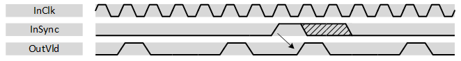

***

[**component list**](../README.md)

# psi_common_strobe_generator
 - VHDL source: [psi_common_strobe_generator](../../hdl/psi_common_strobe_generator.vhd)
 - Testbench source: [psi_common_strobe_generator_tb.vhd](../../testbench/psi_common_strobe_generator_tb/psi_common_strobe_generator_tb.vhd)

### Description

This component implements a synchronous FIFO (same clock for write and
read port). The memory is described in a way that it utilizes RAM
resources (Block-RAM or distributed RAM) available in FPGAs with
commonly used tools.

The FIFO is a fall-through FIFO and has AXI-S interfaces on read and
write side.

The RAM behavior (read-before-write or write-before-read) can be
selected. This allows efficiently implementing FIFOs for different
technologies (some technologies implement one, some the other behavior).

### Generics
| Name          | type      | Description                              |
|:--------------|:----------|:-----------------------------------------|
| freq_clock_g  | real      | clock frequency in hz  |
| freq_strobe_g | real      | strobe frequency in hz |
| rst_pol_g     | std_logic | reset polarity                           |

### Interfaces
| Name   | In/Out   |   Length | Description                         |
|:-------|:---------|---------:|:------------------------------------|
| clk_i  | i        |        1 | clk in  |
| rst_i  | i        |        1 | rst sync  |
| vld_o  | o        |        1 | output strobe                       |

### Synchronization

The strobe synchronization is optional. If no synchronization is required, *sync\_i* can be left unconnected or tied to '0'.

When strobe synchronization is used, the strobe signal is synchronized to rising edges detected on the *sync\_i* input. If a rising edge is
detected on the *sync\_i* input, a strobe is generated in the next cycle. From there, the strobe is running at the normal frequency.

The figure below shows the behavior of strobe synchronization for a strobe output at ¼ of the clock frequency.

[**component list**](../README.md)
