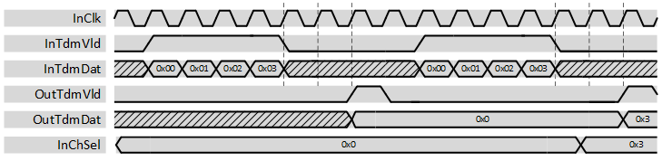

***

[**component list**](../README.md)

# psi_common_tdm_mux
 - VHDL source: [psi_common_tdm_mux](../../hdl/psi_common_tdm_mux.vhd)
 - Testbench source: [psi_common_tdm_mux_tb.vhd](../../testbench/psi_common_tdm_mux_tb/psi_common_tdm_mux_tb.vhd)

### Description

This component allows selecting one unique channel over a bunch of "N" time division multiplexed (tdm) data. The output comes with a strobe/valid signal at the falling edge of the "tdm" strobe/valid input with a two clock cycles latency.

### Generics
| Name              | type      | Description           |
|:------------------|:----------|:----------------------|
| generic(rst_pol_g | std_logic | reset polarity select |
| num_channel_g     | natural   | number of channel     |
| data_length_g     | natural   | data vector width     |

### Interfaces
| Name      | In/Out   | Length         | Description       |
|:----------|:---------|:---------------|:------------------|
| inclk     | i        | 1              | clk in            |
| rst_i     | i        | 1              | sync reset        |
| ch_sel_i  | i        | num_channel_g) | mux select        |
| tdm_vld_i | i        | 1              | tdm strobe        |
| tdm_dat_i | i        | data_length_g  | tdm data          |
| tdm_vld_o | o        | 1              | strobe output     |
| tdm_dat_o | o        | data_length_g  | selected data out |

[**component list**](../README.md)
