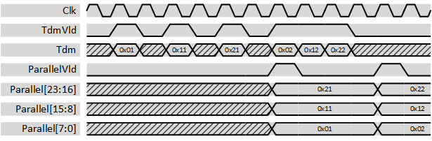
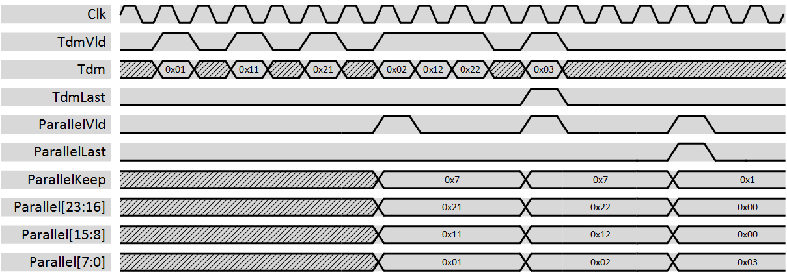

***

[**component list**](../README.md)

# psi_common_tdm_par
 - VHDL source: [psi_common_tdm_par](../../hdl/psi_common_tdm_par.vhd)
 - Testbench source: [psi_common_tdm_par_tb.vhd](../../testbench/psi_common_tdm_par_tb/psi_common_tdm_par_tb.vhd)

### Description

This component changes the representation of multiple channels from time-division-multiplexed to parallel. It does not implement any flow-control.

The figure below shows some waveforms of the conversion. The first input sample is interpreted as channel 0 and played out in the lowest bits of the output, the last input sample is played out in the highest bits.

  

This component also interpretes the *last* flag at the input and generates a correspodning *last* flag as well as a *keep* vector at the output while filling up missing bits with zeros to complete the output word.

Note that the keep vector contains one bit per *word* and not per *bypte*. If data width is 8 bits, the keep verctor can be directly used as *TKEEP* signal of AXI. If data width i 16 bits, each bit of the keep vector must be mapped to two bits of the AXI *TKEEP* signal and so on. With non byte-aligned data widths, there is no general direct mapping possible.

The figure below shows some waveforms of the conversion. The first input sample is interpreted as channel 0 and played out in the lowest bits of the output, the last input sample is played out in the highest bits. The bits of the keep vector are assigned accordingly, i.e. the LSB corresponds to the first input sample.

  

### Generics
| Name            | type      | Description      |
|:----------------|:----------|:-----------------|
| ch_nb_g | natural   | number of channels
| width_g | natural   | data width in bits
| rst_pol_g       | std_logic | reset pol, '1' active high

### Interfaces
| Name       | In/Out   | Length          | Description                |
|:-----------|:---------|:----------------|:---------------------------|
| clk_i      | i        | 1               | Clock
| rst_i      | i        | 1               | Reset
| dat_i      | i        | ch_nb_g 				|  data signal input
| vld_i      | i        | 1               | AXI-S handshaking signal
|tdm_last_i  | i    		| 1 							| TDM input signal, first sample is channel 0.
| rdy_o      | o        | 1               | AXI-S packet boundary signal
| dat_o      | o        | ch_nb_g 			  | data signal output
| vld_o      | o        | 1               | AXI-S handshaking signal
| rdy_i  		 | i  			| 1   					  | AXI-S packet boundary signal  |
| par_keep_o | o        | ch_nb_g				  | AXI-S byte qualifier signal (one bit per *Word* not per *Byte*)
| par_last_o | o        | 1               | Data of all channels in parallel. Channel 0 is in the lowest bits.

[**component list**](../README.md)
