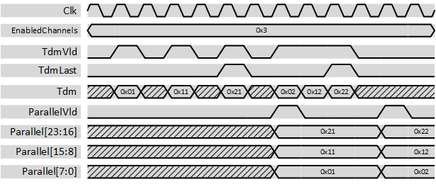
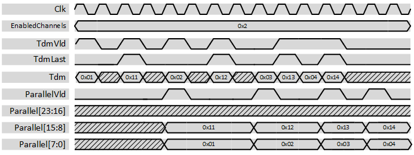

***

[**component list**](../README.md)

# psi_common_tdm_par_cfg
 - VHDL source: [psi_common_tdm_par_cfg](../../hdl/psi_common_tdm_par_cfg.vhd)
 - Testbench source: [psi_common_tdm_par_cfg_tb.vhd](../../testbench/psi_common_tdm_par_cfg_tb/psi_common_tdm_par_cfg_tb.vhd)

### Description

This component changes the representation of multiple channels from time-division-multiplexed to parallel. It does not implement any flow-control.

The number of enabled channels is configurable. In addition, if used with an AXI stream, TdmLast can be used to ensure the correct correspondence between the channels and their indexes in Parallel when the number of enabled channels is changed.

The figures below show some waveforms of the conversion. The first input sample is interpreted as channel 0 and played out in the lowest bits of the output, the last input sample is played out in the enabled highest bits.

 

 3 enabled channels waveform 

 

 2 enabled channels waveform 

Note that the output stays stable also after the *Vld* pulse.

### Generics
| Name            | type      | Description      |
|:----------------|:----------|:-----------------|
| channel_count_g | natural   | $$ constant=3 $$ |
| channel_width_g | natural   | $$ constant=8 $$ |
| rst_pol_g       | std_logic | N.A              |

### Interfaces
| Name   | In/Out   | Length          | Description                |
|:-------|:---------|:----------------|:---------------------------|
| clk_i  | i        | 1               | $$ type=clk; freq=100e6 $$ |
| rst_i  | i        | 1               | $$ type=rst; clk=clk $$    |
| dat_i  | i        | channel_width_g | N.A                        |
| vld_i  | i        | 1               | N.A                        |
| last_i | i        | 1               | N.A                        |
| dat_o  | o        | channel_count_g | N.A                        |
| vld_o  | o        | 1               | N.A                        |

[**component list**](../README.md)
