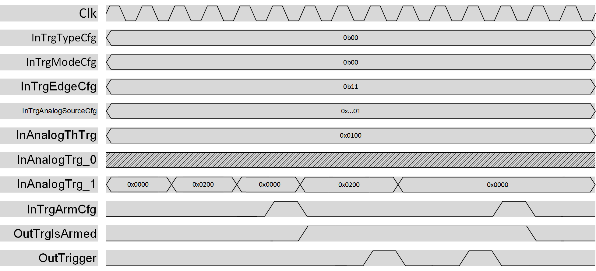

***

[**component list**](../README.md)

# psi_common_trigger_analog
 - VHDL source: [psi_common_trigger_analog](../../hdl/psi_common_trigger_analog.vhd)
 - Testbench source: [psi_common_trigger_analog_tb.vhd](../../testbench/psi_common_trigger_analog_tb/psi_common_trigger_analog_tb.vhd)

### Description
*INSERT YOUR TEXT*

This component can be used to generate a single clock pulse when
 its input value overpass a certain threshold.
The trigger generation can be continuous, hence a pulse is generated every
time the condition is satisfied or single, and the trigger generator must
be re-armed after every generated pulse.
The pulse is generated if the value represented in a (signed or unsigned)
std_logic_vector crosses a threshold value decided by the user, the sensitive
edge can be rising, falling or both.

  

 analog trigger datagram

NOTE: once the selected condition is satisfied, the trigger pulse is generated
with a two clock cycle delay. This is due to the internal logic structure and
it can be compensated externally by the user.

### Generics
| Name              | type      | Description                             |
|:------------------|:----------|:----------------------------------------|
| trig_nb_g 				| integer   | number of analog trigger inputs         |
| width_g           | integer   | analog trigger input signals width      |
| is_signed_g       | boolean   | analog trigger input signals are signed |
| rst_pol_g         | std_logic | reset polarity                          |

### Interfaces
| Name               | In/Out   | Length     | Description                                                                                                                                  |
|:-------------------|:---------|:-----------|:---------------------------------------------------------------------------------------------------------------------------------------------|
| clk_i              | i        | 1          | clk in $$ type=clk; freq=100.0 $$                                                                                                            |
| rst_i              | i        | 1          | rst in $$ type=rst; clk=clk_i $$                                                                                                             |
| trg_arm_cfg_i      | i        | 1          | Trigger mode (0:Continuous,1:Single) configuration register										                                                              |
| trg_anlg_src_cfg_i | i        | trig_nb_g  | trigger source configuration register                                                                                                        |
| trg_arm_cfg_i   	 | i   			| 1   			 | Arm/dis--arm the trigger, rising edge sensitive																																													    |
| trg_edge_cfg_i     | i        | 2			     | Trigger edge direction configuration register (bit0:falling edge sensitive, bit1: rising edge sensitive)																		  |
| trg_anlg_src_cfg_i | i        | log2(trig_nb)| Trigger source configuration  register																																																	    |
| anl_th_trig_i      | i        | width_g    | analog trigger threshold value                                                                                                               |
| anl_trig_i         | i        | trig_nb_g  | analog input values                                                                                                                          |
| ext_disarm_i       | i        | 1          | if different trigger causes are armed at the same time for a single trigger all the other cause must be disarmed once a trigger is generated |
| trg_is_armed_i     | o        | 1          | trigger is armed and ready to be released                                                                                                    |
| trig_o             | o        | 1          | trigger output                                                                                                                               |

[**component list**](../README.md)
