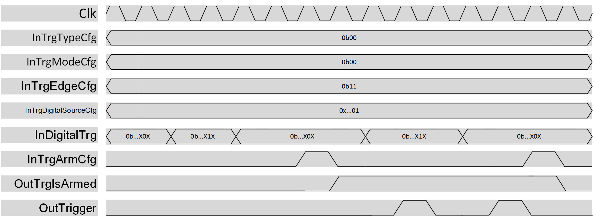

***

[**component list**](../README.md)

# psi_common_trigger_digital
 - VHDL source: [psi_common_trigger_digital](../../hdl/psi_common_trigger_digital.vhd)
 - Testbench source: [psi_common_trigger_digital_tb.vhd](../../testbench/psi_common_trigger_digital_tb/psi_common_trigger_digital_tb.vhd)

### Description

This component can be used to generate a single trigger pulse when a rising
and/or a falling edge of a std_logic signal is detected at the input.
The trigger generation can be continuous, hence a pulse is generated every
time the condition is satisfied or single, and the trigger generator must be
re-armed after a pulse is generated in this case.

  

 digital trigger datagram

NOTE: once the selected condition is satisfied, the trigger pulse is generated
with a one clock cycle delay. This is due to the internal logic structure
and it can be compensated externally by the user.

### Generics
| Name              | type      | Description                      |
|:------------------|:----------|:---------------------------------|
| trig_nb_g				  | integer   | number of digital trigger inputs |
| rst_pol_g         | std_logic | reset polarity                   |

### Interfaces
| Name                     | In/Out   | Length     | Description                                                                                                                                  |
|:-------------------------|:---------|:-----------|:---------------------------------------------------------------------------------------------------------------------------------------------|
| clk_i                    | i        | 1          | clk in                                                                                                                                       |
| rst_i                    | i        | 1          | rst in                                                                                                                                       |
| trg_arm_cfg_i            | i        | 1          | N.A                                                                                                                                          |
|trg_mode_cfg_i   				 | i  		  | 1  				 | Trigger mode (0:Continuous,1:Single) configuration register																																							    |
|trg_arm_cfg_i   					 | i   		  | 1   			 | Arm/dis--arm the trigger, rising edge sensitive																																													    |
| trg_edge_cfg_i   				 | i   		  | 1   			 | Trigger edge direction configuration register (bit0:falling edge sensitive, bit1: rising edge sensitive																	    |
| trg_digital_source_cfg_i | i        | trig_nb_g  | trigger source configuration register                                                                                                        |
| digital_trg_i            | i        | trig_nb_g  | digital trigger input                                                                                                                        |
| ext_disarm_i             | i        | 1          | if different trigger causes are armed at the same time for a single trigger all the other cause must be disarmed once a trigger is generated |
| trg_is_armed_o           | o        | 1          |                                                                                                                                              |
| trigger_o                | o        | 1          | trigger output                                                                                                                               |

[**component list**](../README.md)
