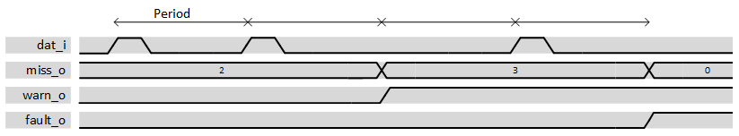

***

[**component list**](../README.md)

# psi_common_watchdog
 - VHDL source: [psi_common_watchdog](../../hdl/psi_common_watchdog.vhd)
 - Testbench source: [psi_common_watchdog_tb.vhd](../../testbench/psi_common_watchdog_tb/psi_common_watchdog_tb.vhd)

### Description

This block is checking if an event signal is active within a predefined
particular time period by user through generics. The typical usage of
this block is to check pulse activity but vector can be fed in. It has
three outputs, the missing counter value, warning flag and error flag,
via the reset one can restart the missing value to zero and erase output
flags. Two modes can be set via the generic "*thld\_fault\_succ\_g*",
setting a positive value will enable the mode which will count only
successive missing events prior to rise a flag.

  

 datagram total missing event mode 

On the graph above the total amount of missing event is checked and the
missing counter is not reset to 0 when an expected event occurs. Warning
and Fault thresholds have been respectively set to 3 and 4. The
successive fault threshold has been set 0 whereas on the graph below it
has been set to 4, therefore as soon a new event occurs within period
the missing counter is reset to 0 and flag are de-asserted.

  

 datagram successive missing event mode 

### Generics
| Name               | type      | Description                     |
|:-------------------|:----------|:--------------------------------|
| freq_clk_g 				 | real      | clock frequency in hz           |
| freq_act_g         | real      | event frequency in hz           |
| thld_fault_total_g | positive  | threshold for total errors      |
| thld_warn_g        | positive  | threshold for warning           |
| thld_fault_succ_g  | integer   | threshold for successive errors |
| length_g           | integer   | data input length               |
| rst_pol_g          | std_logic | polarity reset                  |

### Interfaces
| Name    | In/Out   | Length              | Description     |
|:--------|:---------|:--------------------|:----------------|
| clk_i   | i        | 1                   | clock           |
| rst_i   | i        | 1                   | reset           |
| dat_i   | i        | length_g            | input data      |
| warn_o  | o        | 1                   | warning flag    |
| miss_o  | o        | thld_fault_total_g) | missing counter |
| fault_o | o        | 1                   | fault flag      |

[**component list**](../README.md)
