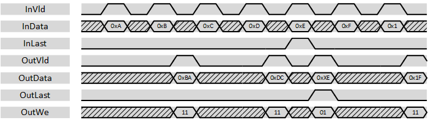

***

[**component list**](../README.md)

# psi_common_wconv_n2xn
 - VHDL source: [psi_common_wconv_n2xn](../../hdl/psi_common_wconv_n2xn.vhd)
 - Testbench source: [psi_common_wconv_n2xn_tb.vhd](../../testbench/psi_common_wconv_n2xn_tb/psi_common_wconv_n2xn_tb.vhd)

### Description

This component implements a data width conversion from N-bits to a multiple of N-bits. The sample rate is reduced accordingly. The width conversion implements AXI-S handshaking signals to handle back-pressure.

The with conversion supports back-to-back conversions (*vld_i* can stay high all the time). It also handles the last-flag correctly according to AXI specification. If *last_i* is asserted, all data is flushed out and
the word enabled (*we_o*) at the output are set only for words that contain data. *last_o* is asserted accordingly.

The entity does little-endian data alignment as shown in the figure below.

This entity does only do a width conversion but not clock crossing. If a half-clock-double-width conversion is used, *psi\_common\_sync\_cc\_xn2n* component can be used after the width conversion.

### Generics
| Name        | type      | Description       |
|:------------|:----------|:------------------|
| width_in_g  | natural;  | Input data width  |
| width_out_g | natural;  | Output data width |
| rst_pol_g   | std_logic | '1' active high, '0' active low        |

The ratio width_out_g/width_in_g must be an integer number and *width_out_g\_g* must be bigger or equal to *width_in_g\_g*.

### Interfaces
Signal          | Direction | Width           | Description     
----------------|-----------|-----------------|-----------------               
clk_i           | Input     | 1               | Clock           
rst_i           | Input     | 1               | Reset (high active)                 
vld_i           | Input     | 1               | AXI-S handshaking signal          
rdy_o           | Output    | 1               | AXI-S handshaking     signal          
dat_i           | Input     | InWidth\_g      | Data signal input           
last_i          | Input     | 1               | AXI-S handshaking signal If last_i is asserted, the data stored inside the with-conversion is flushed out.
vld_o           | Output    | 1               | AXI-S handshaking signal          
rdy_i           | Input     | 1               | AXI-S handshaking signal          
dat_o           | Output    | OutWidth\_g     | Data signal output          
last_o          | Output    | 1               | AXI-S handshaking signal          
we_o            | Output    | OutWidth\_g/InWidth\_g  | Output word-enable. Works like byte-enable but with one bit per input-word. All bits in this signal are set, exept for with conversion results flushed  out by *last_i='1'*. In this case, the *we_o* bits indicate wich *dat_o* bits contain valid data.

[**component list**](../README.md)
