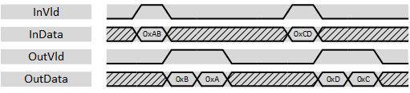
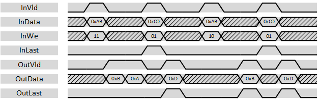

***

[**component list**](../README.md)

# psi_common_wconv_xn2n
 - VHDL source: [psi_common_wconv_xn2n](../../hdl/psi_common_wconv_xn2n.vhd)
 - Testbench source: [psi_common_wconv_xn2n_tb.vhd](../../testbench/psi_common_wconv_xn2n_tb/psi_common_wconv_xn2n_tb.vhd)

### Description

This component implements a data width conversion from a multiple N-bits to a N-bits. The sample rate is increased accordingly. The width conversion implements AXI-S handshaking signals to handle back-pressure.

The width conversion does support back-to-back conversions (*vld_o/rdy_i* can stay high all the time).

The entity does little-endian data alignment as shown in the figure below.

  

 Data alignment 

The with conversion does also handle the last-flag according to AXI specification and it can do alignment. To do so, an input word-enable signal *we_i* exists. Words that are not enabled are not sent to the output. If the input is marked with the *last_i* flag, the last enabled word is marked with *last_o* at the output.

Note that with the assertion of *last_i* at least one byte of the data must be valid (*we_i* high). Otherwise it would be unclear when *last_o* shall be assigned.

  

 Last-Handling and alignment 

This entity does only do a width conversion but not clock crossing. If a double-clock-half-width conversion is used, *psi\_common\_sync\_cc\_n2xn* component can be used in front of the
width conversion.

### Generics
| Name        | type     | Description       |
|:------------|:---------|:------------------|
| width_in_g  | natural; | Input data width  |
| width_out_g | natural  | Output data width |

The ratio in_width_g\_g/out_width_g\_g must be an integer number and *width_in_g \_g* must be bigger or equal to *width_out_g\_g*.

### Interfaces
Signal          | Direction | Width           | Description     
----------------|-----------|-----------------|-----------------               
clk_i           | Input     | 1               | Clock           
rst_i           | Input     | 1               | Reset (high active)                 
vld_i           | Input     | 1               | AXI-S handshaking signal          
rdy_o           | Output    | 1               | AXI-S handshaking     signal          
dat_i           | Input     | width_in_g      | Data signal input           
last_i          | Input     | 1               | AXI-S handshaking signal
we_i            | Input     | width_ing/width_out_g  | Input word-enable. Works like byte-enable but with one bit per input-word. At least one word must be enabled together with the assertion of InLast   
vld_o           | Output    | 1               | AXI-S handshaking signal          
rdy_i           | Input     | 1               | AXI-S handshaking signal          
dat_o           | Output    | width_out_g     | Data signal output          
last_o          | Output    | 1               | AXI-S handshaking signal

[**component list**](../README.md)
