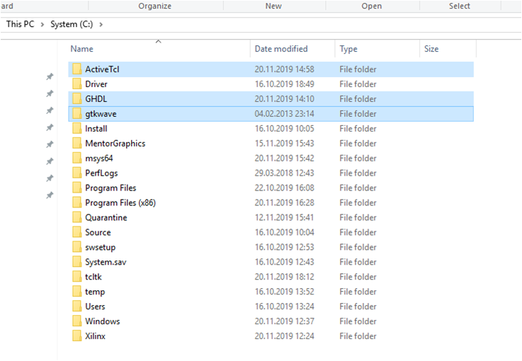
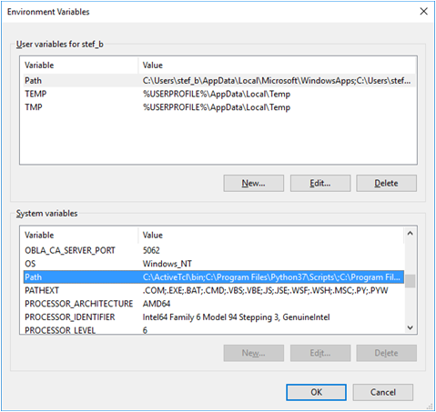
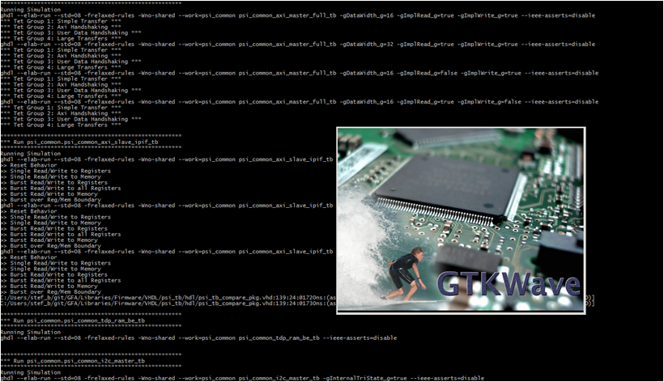

# GHDL install & use

## install
1. Download Windows install of GHDL from github [link](https://github.com/ghdl/ghdl/releases/download/v0.36/ghdl-0.36-mingw32-mcode.zip)
 1. Set the Download binary to C:/
 2. Set the binary to your path environment variables
3. Download a TCL interpreter such as ActiveTCL for instance [link](https://www.activestate.com/products/tcl/)
 1. Set binaries to your Path environment variable and make sure you can run *tclsh* from the command line
 2. Set the binary to your path environment variables
5. Download GTKwave [link](https://sourceforge.net/projects/gtkwave/)
 1. Set the Download binary to C:/
 2. Set the binary to your path environment variables

You should have something like this (recommended)


open the search windows type env and edit the path in adding __bin__ folders




## Use
Open a Windows command lines bash and go to the sim directory of the library
1. launch tclsh, this will invoke a tcl shell

```
..\psi_common\sim>tclsh
%
```

2. run the Ghdl tcl script, this will call PsiSim.tcl make sure to have the same folders structure

```
%source ./runGhdl.tcl
%initialize PsiSim
%---------------------------
%-- Compile
%...
```

3. Once all files are compiled and all testbenches have been launched and run you can observe waveform by the help of _GTKwave_ but first you must run the testbench as follow to produce a waveform file stored in the directory as vcd

```
%ghdl -r --std=08 -frelaxed-rules --work=psi_commmon psi_common_ping_pong_tb --vcd=psi_common_ping_pong_tb_wave.vcd --ieee-asserts=disable -gfreq_data_clk_g=100E6
%
```

4. then you call gtkwave with the vcd files just produced previously

```
%gtkwave psi_common_tdm_mux_tb_wave.vcd
```



