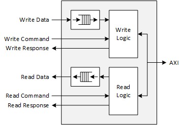
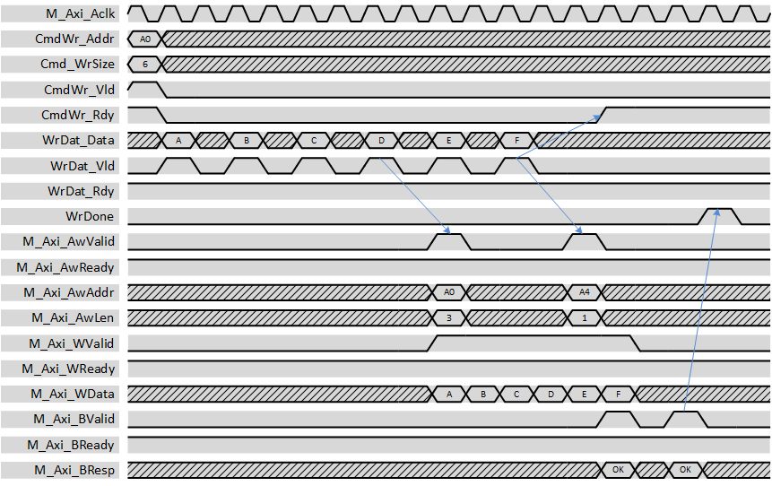
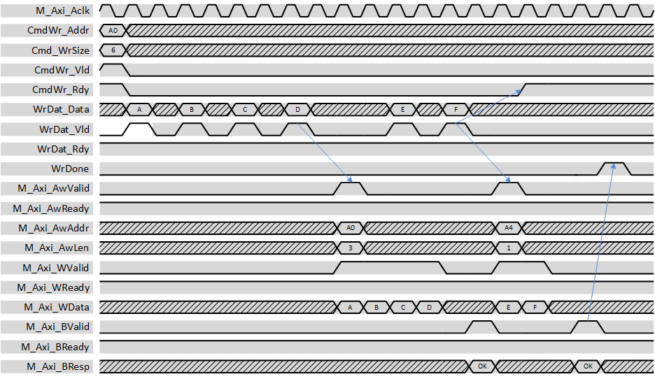
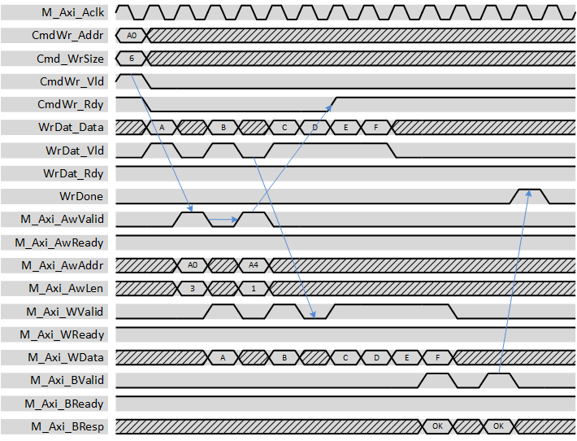
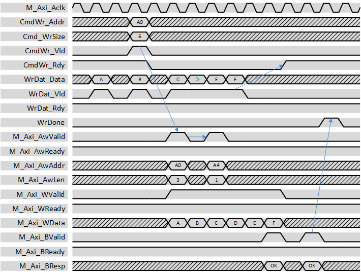
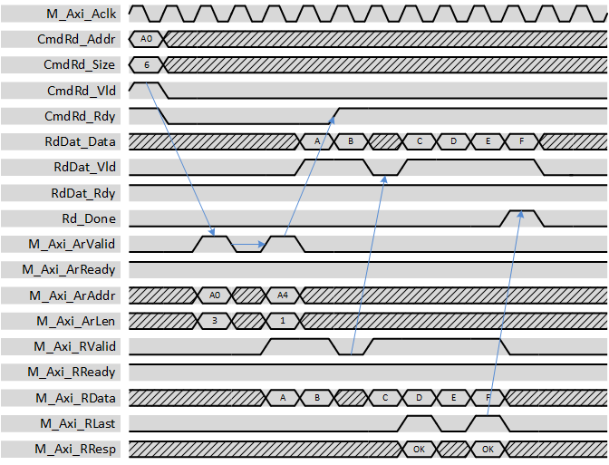
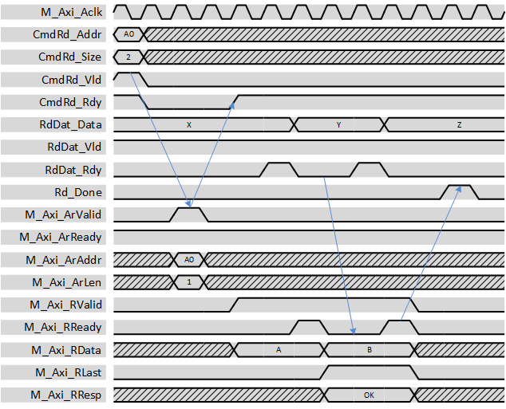
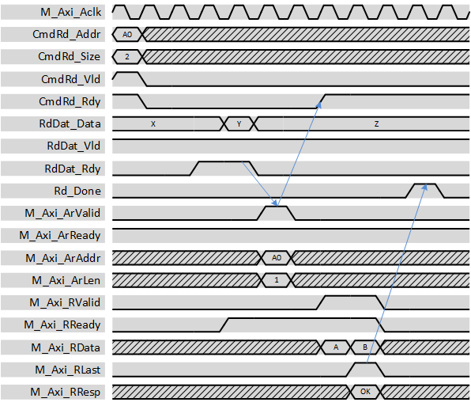

***
# psi_common_axi_master_simple

- VHDL source: [psi_common_axi_master_simple.vhd](../../hdl/psi_common_axi_master_simple.vhd)
- Testbench: [psi_common_axi_master_simple_tb.vhd](../../testbench/psi_common_axi_master_simple_tb/psi_common_axi_master_simple_tb.vhd)

### 1 Description

This entity executes transactions requested through a simple command
interface on an AXI bus according to all specifications. This entity
includes FIFOs to buffer read- and write-data but not for the commands.

The user can request transaction of any size and they will get split
automatically in order to not exceed AXI bust size and other
limitations. The response is sent to the user when his whole command is
executed (which may involve multiple AXI transactions).

For each command there are two operation modes:

-   High Latency

    -   The AXI-master only starts the command after sufficient data
        (write-case) or space (read-case) is available in the
        corresponding data FIFO

    -   This ensures that commands can be executed without blocking the
        AXI bus.

    -   This approach leads to more latency, since he user has to handle
        data before the command is sent.

-   Low Latency

    -   The AXI-master starts the transaction immediately, with no
        regard on FIFO states.

    -   If the user logic cannot provide the data in-time, the AXI bus
        may get blocked.

    -   This approach leads to lowest latency since the user logic can
        prepare the data on the fly without the transaction being
        delayed.

This entity does not handle unaligned transactions and word-width
conversions. So the data- and AXI-width are the same and all commands
must be aligned to that word-width. This is the reason for the term
*simple* in the name of the entity.

Read and write logic are fully independent. So reads and writes can
happen at the same time.

There is no required timing relationship between command and data
signals. So for writes the user can provide write data before, after or
together with the command.

 Block Diagram 

### 2. Transaction Types

For simplicity, only burst transactions are shown. However also single-word transactions are supported.

Note that for all examples, the maximum AXI burst length is assumed to
be 4 (unusual low) for illustrative reasons.

Also not that latencies and delays may be drawn shorter than they
actually are to keep the waveforms small. However, all relationship
between signals are correct.

#### 2.1 Write High-Latency

The example below shows a high latency burst read transaction.

 High latency write 

The waveform shows, that the write command (*M\_Axi\_Aw\**) is held back
until all data for a burst (4 words) is in the FIFO. The command is then
executed. The next command is executed immediately, because the data is
already available when the first transaction completed.

The waveform also clearly shows, that the *CmdWr\_Rdy* signals goes high
as soon as all AXI-commands related to the user command are sent.
However, at the time *CmdWr\_Rdy* goes high, not all data is transferred
yet. This only indicates that the next command can be applied and does
not have any meaning for the currently processed signal.

The *WrDone* signal is pulsed as soon as the response of the last AXI
transaction is received.

The waveform also clearly shows that a user command is split into two
AXI transactions automatically and that the *M\_Axi\_AwAddr* and
*M\_Axi\_AwLen* signals are chosen appropriately.

Since the waveform above only shows that the first transaction is
delayed according to high-latency operation, a second figure is shown
below that shows this behavior also for the second transaction.

 High latency write with delay for second transaction 

#### 2.2 Write Low-Latency

The example below shows a low latency burst read transaction.

 Low latency write 

The waveform shows, that in low latency operation, AXI commands are
issued as soon as possible independently of the availability of data.
Therefore both write commands are issued before even the data for the
first one is in the FIFO.

The waveform also shows, that the *M\_AXI\_W\** bus is blocked
temporarily (*M\_Axi\_WValid* low) due to the data not being available.
This situation has a negative impact on the AXI bandwidth, so it shall
be avoided usually.

To avoid stalling the AXI bus, it is possible to prefill the write data
FIFO. To do so, the write command is sent after the first few data
samples are already written into the FIFO. This allows using the FIFO to
prevent the AXI bus from stalling.

 Low latency write with FIFO prefill 

#### 2.3 Read

The example below shows a burst read transaction.

 Read transaction 

Usually for reads there is enough space in the read FIFO. In this case,
the user command directly triggers the transmission of the AXI-command
on *M\_Axi\_Ar\**. After all AXI commands are sent, the FSM is ready for
the next command.

If the slave is not able to continuously burst data, this is reflected
on the read data output. However, a FIFO is present and can compensate
this effect if reading of the data is started a few beats after
availability of first data.

#### 2.4 Read FIFO full with Low Latency

The example below shows a burst read transaction in low latency mode. In
contrast to the example above, the read FIFO is assumed to be full when
the user command is issued.

Please read the description of all examples (10.3.2).

 Read transaction, low latency 

Because the command is issued in low-latency mode, the AXI read command
is issued immediately. Because the FIFO is full, *M\_Axi\_RReady* is low
and the AXI bus is stalled. The pattern of space in the FIFO becoming
available is visible on the AXI bus directly.

#### 2.5 Read FIFO full with High Latency

The example below shows a burst read transaction in high latency mode.
In contrast to the example above, the read FIFO is assumed to be full
when the user command is issued.

 Read transaction, high latency 

Because the command is issued in high-latency mode, the AXI read command
is not issued until enough data is read from the FIFO in order for the
command to complete in one burst. If this is the case, the AXI read
command is issued and the transfer is completed in one burst with
*M\_Axi\_RValid* high all the time.

This has the benefit of not blocking the AXI bus. In contrast to write
commands, the high-latency mode does not lead to significantly more
latency in the read-case because the user can still immediately read the
first data after it was received. As a result, it is recommended to
always execute read commands I the high-latency mode unless there is a
very good reason for the low-latency mode.

### 3. Generics

Generics                       | Descritption
-------------------------------|-----------------------------------------------------------
**AxiAddrWidth\_g**            |Width of the AXI address bus\
**AxiDataWidth\_g**            |Width of the AXI data bus\
**AxiMaxBeats\_g**             |Maximum number of beats in one AXI transaction. Values given by the\ AXI specification are 16 for AXI-3 and 256 for AXI-4. However, the user\ may choose any other number for scheduling reasons.\
**AxiMaxOpenTransactions\_g**  |Maximum number of AXI commands(AW/AR-channel) to send before\ the first command is completed (outstanding transactions).\
**UserTransactionSizeBits \_g**|Number of bits used to specify the number of beats to transfer on the\ user command interface. This is the only limiting factor for the transfer\ size requested.\
**DataFifoDepth\_g**           |Number of entries in the read/write data FIFOs\
**ImplRead\_g**                |Implement read functionality (can be disabled to save resources)\
**ImplWrite\_g**               |Implement write functionality (can be disabled to save resources)\
**RamBehavior\_g**             |Block-RAM style (must match FPGA architecture) **"RBW"** Read before write, **"WBR"** Write before read

### 4. Interfaces

Signal                      |Direction |Width                         |Description
----------------------------|----------|------------------------------|--------------------------------------------------------------------------------------------------------------
***Control Signals***       |          |                              |
M\_Axi\_Aclk                |Input     |1                             |Clock
M\_Axi\_Aresetn             |Input     |1                             |Reset (low active)
***Write Command***         |          |                              |
CmdWr\_Addr                 |Input     |*AxiAddrWidth\_g*             |Address to start writing at (must be aligned)
CmdWr\_Size                 |Input     |*UserTransactionSizeBits\_g*  |Number of beats in the transfer
CmdWr\_LowLat               |Input     |1                             |**'1'** \--\> Low latency mode, **'0'** \--\> High latency mode
CmdWr\_Vld                  |Input     |1                             |AXI-S handshaking signal
CmdWr\_Rdy                  |Output    |*1*                           |AXI-S handshaking signal
***Read Command***          |          |                              |
CmdRd\_Addr                 |Input     |*AxiAddrWidth\_g*             |Address to start reading at (must be aligned)
CmdRd\_Size                 |Input     |*UserTransactionSizeBits\_g*  |Number of beats in the transfer
CmdRd\_LowLat               |Input     |1                             |**'1'** \--\> Low latency mode, **'0'** \--\> High latency mode
CmdRd\_Vld                  |Input     |1                             |AXI-S handshaking signal
CmdRd\_Rdy                  |Output    |1                             |AXI-S handshaking signal
***Write Data***            |          |                              |
WrDat\_Data                 |Input     |*AxiDataWidth\_g*             |Write data
WrDat\_Be                   |Input     |*AxiDataWidth\_g/8*           |Byte enables for write data
WrDat\_Vld                  |Input     |1                             |AXI-S handshaking signal
WrDat\_Rdy                  |Output    |1                             |AXI-S handshaking signal
***Read Data***             |          |                              |
RdDat\_Data                 |Output    |*AxiDataWidth\_g*             |Read data
RdDat\_Vld                  |Output    |1                             |AXI-S handshaking signal
RdDat\_Rdy                  |Input     |1                             |AXI-S handshaking signal
***Response***              |          |                              |
Wr\_Done                    |Output    |1                             |Write command was completed successfully
Wr\_Error                   |Output    |1                             |Write command was completed but at least one transaction failed (AXI response from slave indicated an error)
Rd\_Done                    |Output    |1                             |Read command was completed successfully
Rd\_Error                   |Output    |1                             |Read command was completed but at least one transaction failed (AXI response from slave indicated an error)
***AXI Master Interface***  |          |                              |
M\_Axi\_\*                  |\*        |\*                            |AXI signals, see AXI specification

***
[Index](../psi_common_index.md) **|** Previous: [Interfaces > i2c master](../ch10_interfaces/ch10_2_i2c_master.md) **|** Next: [Interfaces > axi master full](../ch10_interfaces/ch10_4_axi_master_full.md)
