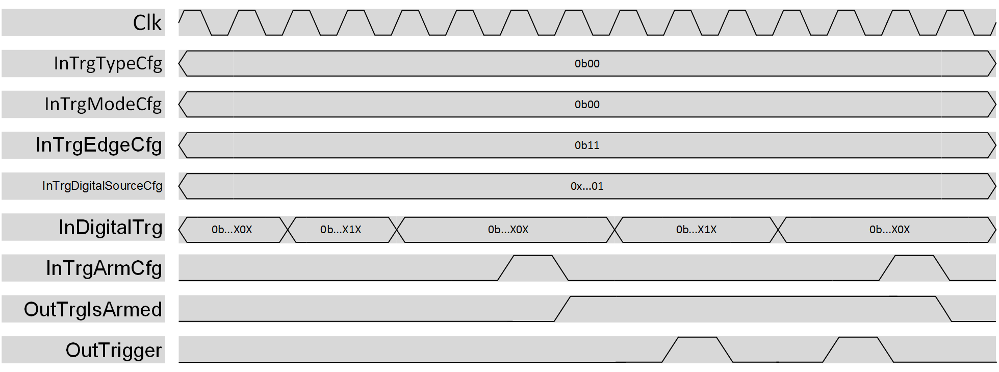

***

# psi_common_trigger_digital

- VHDL source: [psi_common_trigger_digital.vhd](../../hdl/psi_common_trigger_digital.vhd)
- Testbench: [psi_common_trigger_digital_tb.vhd](../../testbench/psi_common_trigger_digital_tb/psi_common_trigger_digital_tb.vhd)

### Description

This component can be used to generate a single trigger pulse when a rising 
and/or a falling edge of a std_logic signal is detected at the input.
The trigger generation can be continuous, hence a pulse is generated every 
time the condition is satisfied or single, and the trigger generator must be 
re-armed after a pulse is generated in this case.

  

 digital trigger datagram

NOTE: once the selected condition is satisfied, the trigger pulse is generated 
with a one clock cycle delay. This is due to the internal logic structure 
and it can be compensated externally by the user.

### Generics

Generics                      | Description
------------------------------|-------------------------------------------------------------
**digital\_input\_number\_g** |Number of digital trigger input
**rst\_pol\_g**               |Reset polarity ('1' or '0')

### Interfaces
Signal                |Direction  |Width                               |Description
----------------------|-----------|------------------------------------|--------------------------------------------------------------------------------------------------
InClk                 |Input      |1                                   |Clock
InRst                 |Input      |1                                   |Reset (polarity set by generic)
InTrgModeCfg          |Input      |1                                   |Trigger mode: 0:Continuous, 1:Single 
InTrgArmCfg           |Input      |1                                   |Arm or Dis-arm the trigger mechanism. The logic is sensitive to the rising edge of this signal.
InTrgEdgeCfg          |Input      |2                                   |Trigger edge direction: bit 1: if 1 rising edge enabled, bit 0: if 1 falling edge enabled
InTrgDigitalSourceCfg |Input      |log2ceil(digital\_input\_number\_g) |Select which IndigitalTrg use as input
InDigitalTrg          |Input      |digital\_input\_number\_g           |Digital input values
InExtDisarm           |Input      |1                                   |Disarm the trigger without generating the OutTrigger pulse. Useful if the logic is used with other trigger logic 
OutTrgIsArmed         |Output     |1                                   |If the trigger mechanism is armed, this output is 1
OutTrigger            |Output     |1                                   |When the selected input passes the threshold value, a single clock pulse is generated

***
[Index](../psi_common_index.md) **|** Previous: [Misc > trigger analog](../ch11_misc/ch11_9_trigger_analog.md) **|** Next:  [Misc > dynamic shifter](../ch11_misc/ch11_11_dyn_sft.md)
