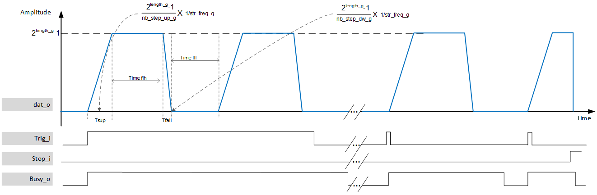

***
# psi_common_pulse_generator_ctrl_static

- VHDL source: [psi_common_pulse_generator_ctrl_static.vhd](../../hdl/psi_common_pulse_generator_ctrl_static.vhd)
- Testbench:  [psi_common_pulse_generator_ctrl_static_tb.vhd](../../testbench/psi_common_pulse_generator_ctrl_static_tb/psi_common_pulse_generator_ctrl_static_tb.vhd)

### Description
This component implements a pulse generator with static parameters via generics. It create pulses from 0 to the max value defined by the vector data length. The user can set the rising time, the flat top duration and the falling time. The component is responsive to the trigger input (_edge detection_), however if the signal is left to '1' then the block will perform consecutive pulses with the selected parameters. Another parameter allow to define the time duration when a pulse returns to 0.
During a full cycle, from ramping up, flat top, ramping down and return 0 for the time duration set the component is busy and will not react to another trigger input.

### Generics

Generics          | Description
------------------|-------------------------------------------------
**rst_pol_g** 		| reset polarity ('1' or '0')
**length_g** 			| data vector length in bits
**clk_freq_g**    | Clock frequency in Hz
**str_freq_g**    | Strobe output || increment strobe in Hz
**nb_step_up_g**  | ramp up param step in str
**nb_step_dw_g**  | ramp down param step in str
**nb_step_flh_g** | flat level param step in str
**nb_step_fll_g** | low level param step in str    

### Interfaces

Signal  |Direction  |Width   |Description
--------|-----------|--------|---------------------------------
clk_i  	|Input      |1       |Clock
rst_i  	|Input      |1       |Reset
str_i   |Input      |1  		 |strobe input
trig_i  |Input      |1			 | set the level to reach (usgin)
stop_i  |Input 		  |1 			 | stop pulse and set output to zero
busy_o 	| output    |1   	 	 | set to 1 when the block is in process
str_o  	| output    |1   	 	 |  strobe Output
dat_o   | output    | length_g   |  data output

[Index](../psi_common_index.md) **|** Previous: [Misc > ramp generator](../ch11_misc/ch11_12_ramp_gene.md) **|** Next: [Misc > parallel to serial](../ch11_misc/ch11_14_par_ser.md)
