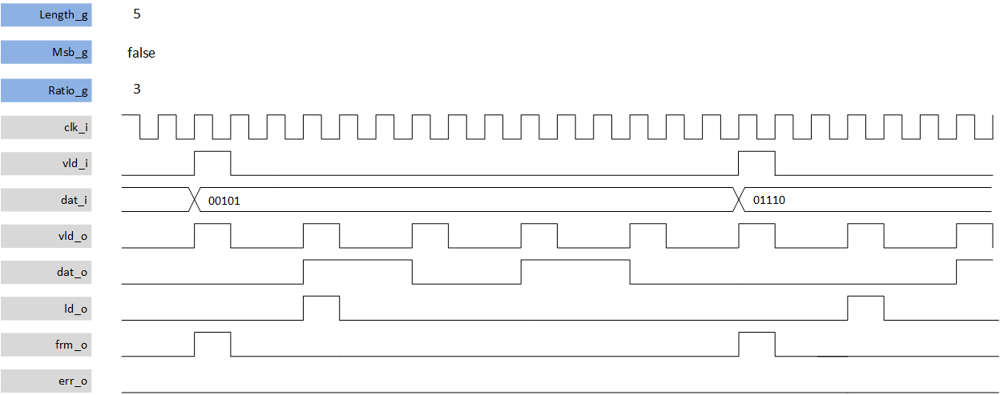
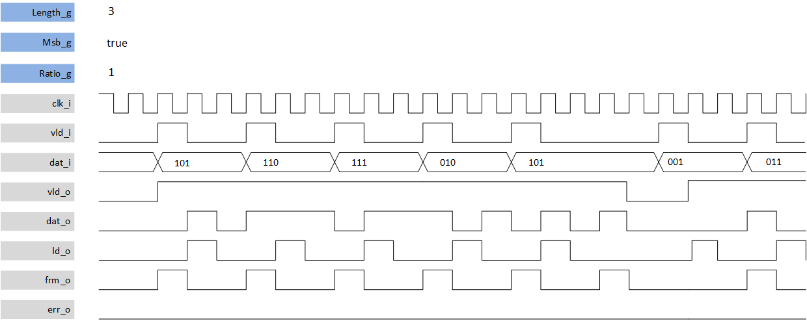

***
# psi_common_par_ser

- VHDL source: [psi_common_par_ser.vhd](../../hdl/psi_common_par_ser.vhd)
- Testbench:  [psi_common_par_ser_tb.vhd](../../testbench/psi_common_par_ser_tb/psi_common_par_ser_tb.vhd)

### Description
This component implements a serializer from a vector, the user indicates either the MSB either LSB are forwarded first with MSB_g generic. The serializer can run at full/clock speed  under one condition is that the input data is sampled at N times lower than the serialized bit where N is the vector input length; if a valid input arrives before this time an error flag is aroused.
Additionally a frame output flag is given at the last serialized bit and a load output is also given at the first output bit. The valid stays high for one clock cycle at each new bit produced.

#### throughput divided by 3 related to clock cycle frequency

#### highest throughput datagram

### Generics

Generics        | Description
----------------|------------------------------
**rst\_pol\_g** |reset polarity ('1' or '0')
**msb\_g** 			|MSB first output if true
**ratio\_g** 		|slow the serialized dat output with ratio to clock freq
**length\_g** 	|Width of the data in bits

### Interfaces

Signal  |Direction  |Width   |Description
--------|-----------|--------|---------------------------------
clk_i  	|Input      |1       |Clock
rst_i  	|Input      |1       |Reset
dat_i  	|Input      |length_g|data vector input to serialize
vld_i   |Input      |1			 |strobe input
vld_o 	|Input 			|1			 |strobe output
dat_o 	|Input 	  	|1			 |data bit output
ld_o    |Input 		  |1 			 |flag load output is high at first output bit
frm_o  	| output    |1   	   |flag frame output is high at last output bit
err_o  	| output    |1   	   |error occurs when *vld_i* arrives before the serializing ended

[Index](../psi_common_index.md) **|** Previous: [Misc > Pulse generator ctrl static](../ch11_misc/ch11_13_pulse_generator_ctrl_static.md) **|** Next [Misc > Serial to parallel](../ch11_misc/ch11_15_ser_par.md)
