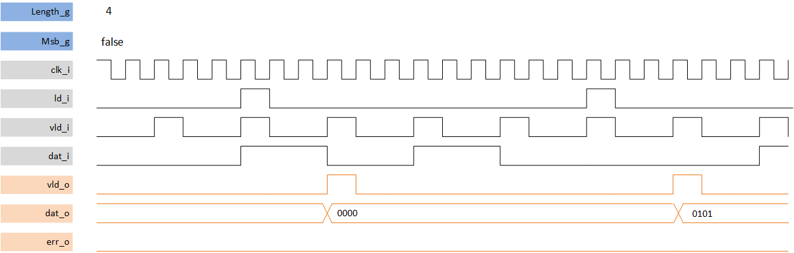

***
# psi_common_par_ser

- VHDL source: [psi_common_ser_par.vhd](../../hdl/psi_common_ser_par.vhd)
- Testbench:  [psi_common_ser_par_tb.vhd](../../testbench/psi_common_ser_par_tb/psi_common_ser_par_tb.vhd)

### Description
This component implements a deserializer, the user indicates either the MSB or LSB are received first with **MSB_g** generic. The deserializer can run at full/clock speed  under one condition is that the input data is sampled at N times lower than the serialized bit where N is the vector input length **ld_i** is used to determine the input sampling frequency; However it is not required to process data. If a load input arrives before this the full de-serializing process has ended up an error flag is aroused.

#### throughput divided by 3 related to clock cycle frequency

### Generics

Generics        | Description
----------------|------------------------------
**rst\_pol\_g** |reset polarity ('1' or '0')
**msb\_g** 			|MSB first output if true
**length\_g** 	|Width of the data in bits

### Interfaces

Signal  |Direction  |Width   |Description
--------|-----------|--------|---------------------------------
clk_i  	|Input      |1       |Clock
rst_i  	|Input      |1       |Reset
dat_i  	|Input      |1			 |data bit input to de-serialize
vld_i   |Input      |1			 |strobe input
vld_o 	|Input 			|1			 |strobe output
dat_o 	|Input 	  	|length_g|data bit output
ld_o    |Input 		  |1 			 |flag load output is high at first output bit
err_o  	| output    |1   	   |error occurs when *ld_i* arrives before the de-serializing ended

[Index](../psi_common_index.md) **|** Previous:  [Misc > Parallel to serial](../ch11_misc/ch11_14_par_ser.md)
