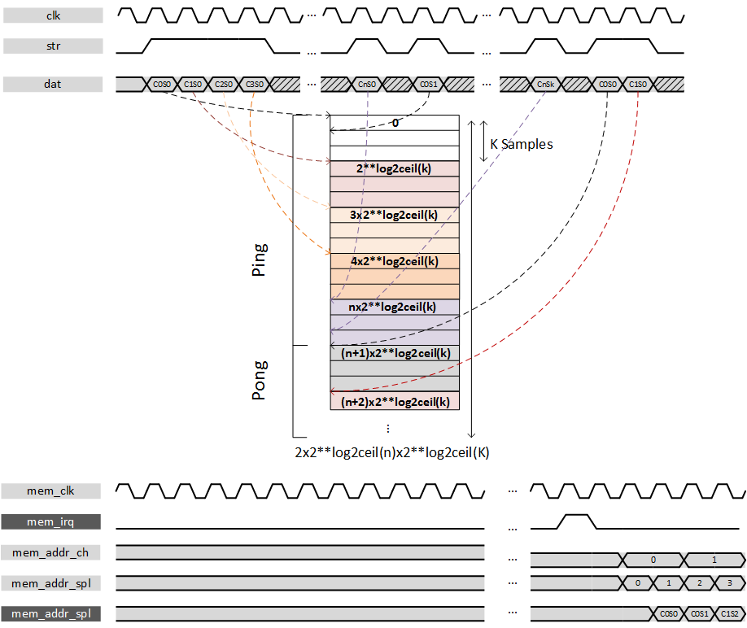
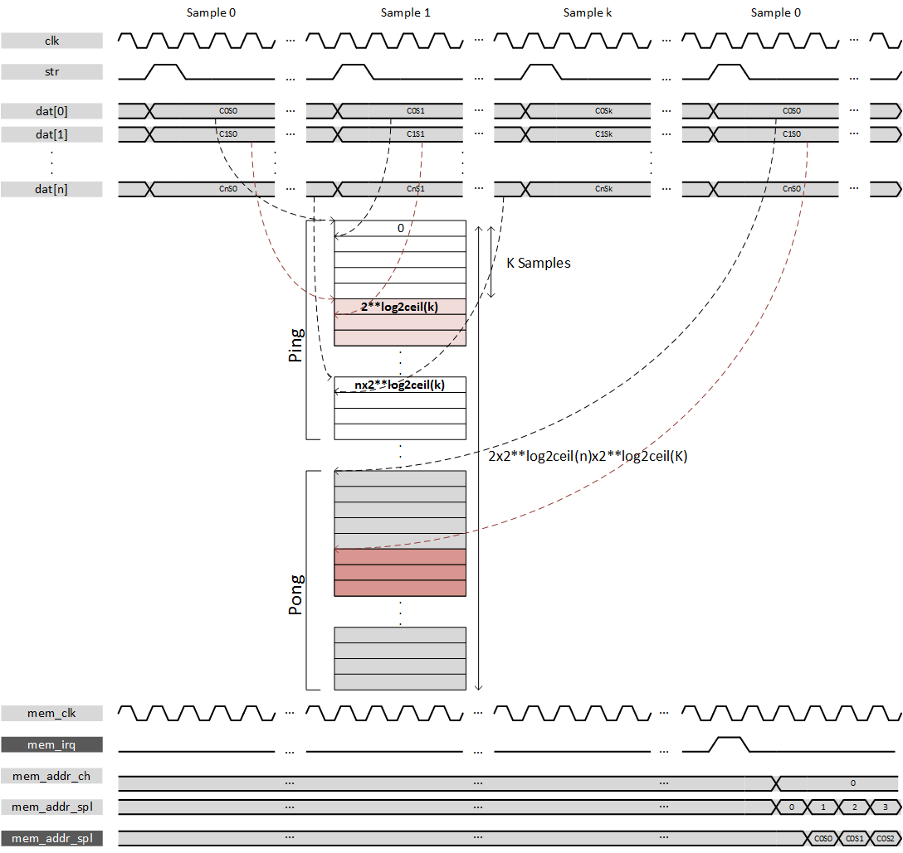

***
# psi_common_ping_pong

- VHDL source: [psi_common_ping_pong.vhd](../../hdl/psi_common_ping_pong.vhd)
- Testbench: [psi_common_ping_pong_tb.vhd](../../testbench/psi_common_ping_pong_tb/psi_common_ping_pong_tb.vhd)

### Description

This component implements a ping pong buffer mechanism around a
***single*** RAM block for multiple channels. It allows to stream data
continuously in moving data back and forth at different memory space.
While a buffer 'Ping' is written the other 'Pong' can be read. An
interrupt is delivered when the buffer writing address swap, it gives
the start indication to read.

The ***memory split between*** "buffers" which correspond to channels is
defined as follow: the memory space necessary for one single channel
will be extracted from the number of samples to be transferred and will
be ceiled to its ***power of 2***. This means gaps may occur if one
choose to forward 500 samples a memory fragmentation of 12 samples per
canal is to be expected. This choice has been to ease the genericity of
the component and its implementation. At the read port it is possible to
select channel independent from sample. The ping pong component allows
either receiving data in parallel either as time division multiplexed.
Fig. 39 gives an overview of the TDM behavior whereas the fig. 40 shows
the TDM mode.

If user wants to use a single channel then the parallel mode is
required.

**Beware** that data sample frequency ratio compared to the clock
cannot be higher than the number of channel. It is not feasible to
several channels simultaneously, in other words **only one sample per
'number of channels' clock cycles**. An associated test
bench helps to determinate proper parameters.

---

 TDM mode 

---

 Parallel mode 

---

Both figures shows hypothetical behaviors for ping pong buffer and the
following convention applies:

-   C: channel

-   S: sample

-   C0S1: Channel 0 & sample 1

### Generics

Generics             | Description
---------------------|----------------------------------
**ch\_nb\_g**        |Number of Channel\
**sample\_nb\_g**    |Number of sample to store
**dat\_length\_g**   |Vector width per channel
**tdm\_g** **True**  |TDM data flow mode, **False** Parallel mode
**ram\_behavior\_g** |"RBW" Read-before-write implementation, "WBR" Write-before read implementation
**rst\_pol\_g**      |Reset polarity

### Interfaces

Signal            | Direction | Width           | Description     
-------------------|-----------|-----------------|-----------------
clk\_i            | Input     | 1               | Clock processing  
rst\_i            | Input     | 1               | Reset processing
dat\_i            | Input     | Generic         | Width depends on the mode: **parallel** = ch\_nb\_g*dat\_length\_g, **tdm** =  dat\_length\_g 
str\_i            | Input     | 1               | data strobe input         
mem\_irq\_o       | Output    | 1               | Interrupt signal high for one clock cycle that indicate that buffer swapped    
mem\_clk\_i       | Input     | 1               | Clock memory    
mem\_addr\_ch\_i  | Input     | Log2ceil(ch\_nb\_g)     | Address corresponding to channel(MSB)
mem\_addr\_spl\_i | Input     | Log2ceil(sample\_nb\_g) | Address corresponding to sample (LSB)              
mem\_dat\_o       | Output    | dat\_length\_g  | Data output  

***
[Index](../psi_common_index.md) **|** Previous: [Misc > multi pl](../ch11_misc/ch11_3_multi_pl_stage.md) **|** Next:  [Misc > delay cfg](../ch11_misc/ch11_5_delay_cfg.md)
