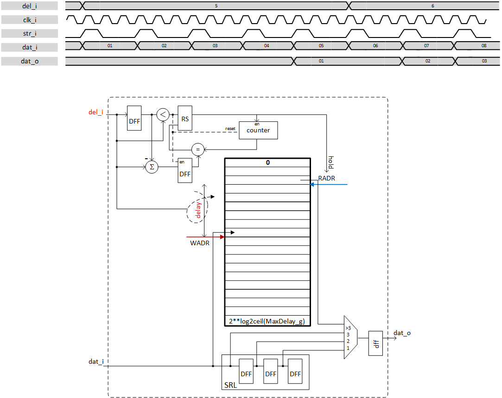

***

# psi_common_delay_cfg

- VHDL source: [psi_common_delay_cfg.vhd](../../hdl/psi_common_delay_cfg.vhd)
- Testbench: [psi_common_delay_cfg_tb.vhd](../../testbench/psi_common_delay_cfg_tb/psi_common_delay_cfg_tb.vhd)

### Description

This component is slightly the same as the [psi_common_delay](../ch11_misc/ch11_1_delay.md) but it is configurable during runtime. It
allows setting the delay by a register. The architecture is based on
block RAM and a SRL an overview is shown on next figure.

Since the latency is set by 3 registers to write, to read from block ram
and to output the value a small shift register is implemented to output
value when delay is inferior or equal to 3.

The delay value 0 isn't covered it will by default have a minimum of one
clock cycle delay.

A generic allows to hold the value when a change is done to increase
delay, this avoid having transient for example. A counter is launched to
compute the delay difference and read address is hold during this time.
This behavior can be skipped.

 

 Hold behavior & pseudo-architecture 

### Generics

Generics           | Description
-------------------|----------------------------------
**Width\_g**       |Width of the data to delay
**MaxDelay\_g**    |Number of delay taps (nb: The RAM size will be the next power of 2 of this value)
**RstPol\_g**      |Polarity reset
**RamBehavior\_g** |**"RBW"** Read-before-write implementation, **"WBR**" Write-before-read implementation
**Hold\_g**   | **True**: While a delay parameter value increase, it holds the last value that where generated and as soon as the delay has been compensated it output the expected value. **False**: output old value that where written previously into the RAM  when the Delay excursion occurred

### Interfaces

Signal                 |Direction  |Width                  |Description
-----------------------|-----------|-----------------------|------------------------------------------------
clk\_i                 |Input      |1                      |Clock
rst\_i                 |Input      |1                      |Reset (polarity set by generic)
str\_i                 |Input      |1                      |InData valid (clock enable for shift register)
dat\_i                 |Input      |Width\_g               |Data input
del\_i                 |Input      |Log2ceil(MaxDelay\_g)  |Number of delay taps
dat\_o                 |Output     |Width\_g               |Data output

***
[Index](../psi_common_index.md) **|** Previous: [Misc > ping pong](../ch11_misc/ch11_4_ping_pong.md) **|** Next: [Misc > watchdog](../ch11_misc/ch11_6_watchdog.md)
