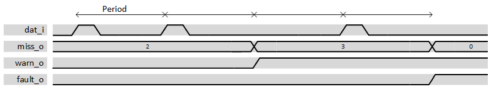
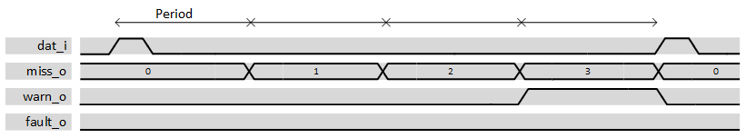

***

# psi_common_watchdog

- VHDL source: [psi_common_watchdog.vhd](../../hdl/psi_common_watchdog.vhd)
- Testbench: [psi_common_watchdog_tb.vhd](../../testbench/psi_common_watchdog_tb/psi_common_watchdog_tb.vhd)

### Description

This block is checking if an event signal is active within a predefined
particular time period by user through generics. The typical usage of
this block is to check pulse activity but vector can be fed in. It has
three outputs, the missing counter value, warning flag and error flag,
via the reset one can restart the missing value to zero and erase output
flags. Two modes can be set via the generic "*thld\_fault\_succ\_g*",
setting a positive value will enable the mode which will count only
successive missing events prior to rise a flag.

  

 datagram total missing event mode 

On the graph above the total amount of missing event is checked and the
missing counter is not reset to 0 when an expected event occurs. Warning
and Fault thresholds have been respectively set to 3 and 4. The
successive fault threshold has been set 0 whereas on the graph below it
has been set to 4, therefore as soon a new event occurs within period
the missing counter is reset to 0 and flag are de-asserted.

  

 datagram successive missing event mode 

### Generics

Generics                  | Description
--------------------------|-------------------------------------------------------------
**freq\_clk\_g**          |Frequency clock
**freq\_act\_g**          |Frequency at which the event should occur
**thld\_fault\_total\_g** |Number of missing events that will rise the error flag
**thld\_warn\_g**         |Number of missing events that will rise the warning flag
**thld\_fault\_succ\_g**  |Number of successive missing events that will rise the error flag **n.b**: Setting this value to 0 will enable the total missing event behavior whereas setting positive value will enable successive missing events behavior
**length\_g**             |Data input vector length
**rst\_pol\_g**           |reset polarity ('1' or '0')

### Interfaces
Signal    |Direction  |Width                     |Description
----------|-----------|--------------------------|--------------------------------------------------------------------------------------------------
clk\_i    |Input      |1                         |Clock
rst\_i    |Input      |1                         |Reset (polarity set by generic)
dat\_i    |Input      |length\_g                 |data input
warn\_o   |Output     |1                         |When the number of missing event has reached the warning threshold value, the output is set to 1
miss\_o   |Output     |Log2ceil(thdl\_fault\_g)  |Number of missing event
fault\_o  |Output     |1                         |Output is set to 1 when number of errors reached

***
[Index](../psi_common_index.md) **|** Previous: [Misc > delay cfg](../ch11_misc/ch11_5_delay_cfg.md) **|** Next:  [Misc > dont opt](../ch11_misc/ch11_7_dont_opt.md)
