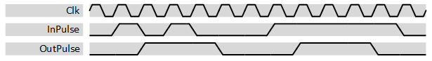

***
# psi_common_pulse_shaper

- VHDL source: [psi_common_pulse_shaper.vhd](../../hdl/psi_common_pulse_shaper.vhd)
- Testbench: [psi_common_pulse_shaper_tb.vhd](../../testbench/psi_common_pulse_shaper_tb/psi_common_pulse_shaper_tb.vhd)

### Description

This component creates pulses of an exactly known length from pulses with unknown length. Additionally it can limit the maximum pulse rate by applying a hold-off time.

Input pulses are detected based on their rising edge.

The figure below shows an example behavior for *Duration\_g=3* and *HoldOff\_g=4*. The first pulse is stretched to three cycles, the second pulse is ignored because it is within the hold-off time and the third pulse is shortened to three cycles.

 Example waveform 

### Generics
Generics        | Description
----------------|--------------
**Duration\_g** | Duration of the output pulse in clock cycles  
**HoldIn\_g**   |If true it holds the input at the output, in case the pulse isn't pulse but a start signal
**HoldOff\_g** | Minimum time between input pulse-rising-edges that are detected (in clock cycles) Pulses arriving during the hold-off time are ignored.

### Interfaces

Signal    |Direction  |Width  |Description
----------|-----------|-------|--------------
Clk       |Input      |1      |Clock input
Rst       |Input      |1      |Reset input
InPulse   |Input      |1      |Input Pulse
OutPulse  |Output     |1      |Output Pulse

***
[Index](../psi_common_index.md) **|** Previous: [timing > tick generator](../ch6_timing/ch6_3_tick_generator.md) **|** Next: [timing > pulse shaper cfg](../ch6_timing/ch6_5_pulse_shaper_cfg.md)
