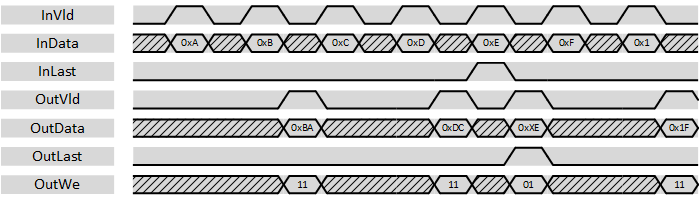

***
# psi_common_wconv_n2xn

- VHDL source: [psi_common_wconv_n2xn.vhd](../../hdl/psi_common_wconv_n2xn.vhd)
- Testbench: [psi_common_wconv_n2xn_tb.vhd](../../testbench/psi_common_wconv_n2xn_tb/psi_common_wconv_n2xn_tb.vhd)

### Description

This component implements a data width conversion from N-bits to a
multiple of N-bits. The sample rate is reduced accordingly. The width
conversion implements AXI-S handshaking signals to handle back-pressure.

The with conversion supports back-to-back conversions (*InVld* can stay
high all the time). It also handles the last-flag correctly according to
AXI specification. If *InLast* is asserted, all data is flushed out and
the word enabled (*OutWe*) at the output are set only for words that
contain data. *OutLast* is asserted accordingly.

The entity does little-endian data alignment as shown in the figure
below.

This entity does only do a width conversion but not clock crossing. If a
half-clock-double-width conversion is used,
*psi\_common\_sync\_cc\_xn2n* component can be used after the width
conversion.

### Generics

Generics        | Description
----------------|-----------------
**InWidth\_g**  |Input data width
**OutWidth\_g** |Output data width

The ratio OutWidth_g/InWidth_g must be an integer number and *OutWidth\_g* must be bigger or equal to *InWidth\_g*.

### Interfaces

 Signal          | Direction | Width           | Description     
-----------------|-----------|-----------------|-----------------               
 Clk             | Input     | 1               | Clock           
 Rst             | Input     | 1               | Reset (high active)                 
 InVld           | Input     | 1               | AXI-S handshaking signal          
 InRdy           | Output    | 1               | AXI-S handshaking     signal          
 InData          | Input     | InWidth\_g      | Data signal input           
 InLast          | Input     | 1               | AXI-S handshaking signal If InLast is asserted, the data stored inside the with-conversion is flushed out.
 OutVld          | Output    | 1               | AXI-S handshaking signal          
 OutRdy          | Input     | 1               | AXI-S handshaking signal          
 OutData         | Output    | OutWidth\_g     | Data signal output          
 OutLast         | Output    | 1               | AXI-S handshaking signal          
 OutWe           | Output    | OutWidth\_g/InWidth\_g  | Output word-enable. Works like byte-enable but with one bit per input-word. All bits in this signal are set, exept for with conversion results flushed  out by *InLast='1'*. In this case, the *OutWe* bits indicate wich *OutData* bits contain valid data.

***
[Index](../psi_common_index.md) **|** Previous: [timing > clk meas](../ch6_timing/ch6_6_clk_meas.md) **|** Next: [conversion > wconv xn2n](../ch7_conversions/ch7_2_wconv_xn2n.md)
