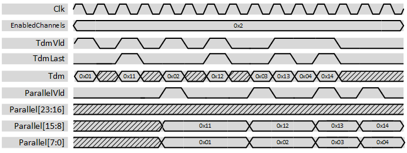

***
# psi_common_tdm_par_cfg

- VHDL source: [psi_common_tdm_par_cfg.vhd](../../hdl/psi_common_tdm_par_cfg.vhd)
- Testbench: [psi_common_tdm_par_cfg_tb.vhd](../../testbench/psi_common_tdm_par_cfg_tb/psi_common_tdm_par_cfg_tb.vhd)

### Description

This component changes the representation of multiple channels from time-division-multiplexed to parallel. It does not implement any flow-control.

The number of enabled channels is configurable. In addition, if used with an AXI stream, TdmLast can be used to ensure the correct correspondence between the channels and their indexes in Parallel when the number of enabled channels is changed.

The figures below show some waveforms of the conversion. The first input sample is interpreted as channel 0 and played out in the lowest bits of the output, the last input sample is played out in the enabled highest bits.

 

 3enabled channels waveform 

 

 2 enabled channels waveform 

Note that the output stays stable also after the *Vld* pulse.

### Generics
Generics            | Description
--------------------|---------
**ChannelCount\_g** | Number of channels
**ChannelWidth\_g** | Number of bits per channel

### Interfaces

Signal                 |Direction  |Width                             | Description
-----------------------|-----------|----------------------------------|--------------------------------------------------------------------
Clk                    |Input      |1                                 | Clock
Rst                    |Input      |1                                 | Reset (high active)
EnabledChannels        |Input      |ChannelCount\_g                   | Number of enabled output channels
TdmVld                 |Input      |1                                 | AXI-S handshaking signal
TdmLast                |Input      |1                                 | AXI-S handshaking signal
Tdm                    |Input      |ChannelWidth                      | TDM input signal, first sample is channel 0.
ParallelVld            |Output     |1                                 | AXI-S handshaking signal
Parallel               |Output     |ChannelCount\_g\*ChannelWidth\_g  | Data of all channels in parallel. Channel 0 is in the lowest bits.

***
[Index](../psi_common_index.md) **|** Previous: [TDM hanlding > tdm par](../ch8_tdm_handling/ch8_2_tdm_par.md) **|** Next: [TDM handling > tdm mux](../ch8_tdm_handling/ch8_4_tdm_mux.md)
